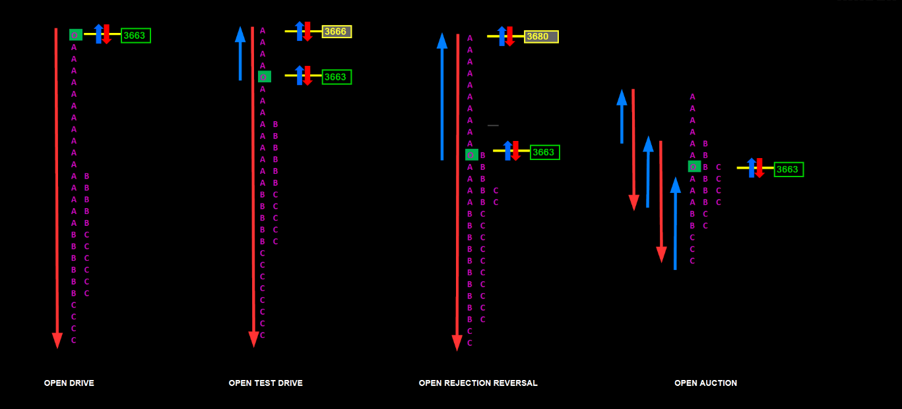

# 📚 SPECIAL NOTES 2 — TYPES OF OPENING



> The market's behavior at the open determines the **entire character** of the day. Learning the 4 types of openings is the key to drawing the day's plan in the first 15 minutes.

---

## 🎯 CONVICTION RANKING (Most Confident → Least Confident)

```
CONVICTION  ████████████████████████  Open Drive
            ██████████████████        Open Test Drive
            ████████████              Open Rejection Reverse
            ██████                    Open Auction

CONFIDENCE  ▓▓▓▓▓▓▓▓▓▓▓▓▓▓▓▓▓▓▓▓▓▓  Most Confident ──────────→ Least Confident
```

---

# 1. 🏎️ OPEN DRIVE

**Conviction: ⭐⭐⭐⭐⭐ MAXIMUM**

---

### Definition

The most decisive opening type. Long-term players have made their decision **before the open** and intentionally drive the market aggressively in one direction.

```
OPEN DRIVE:

Price ↑
  |                         ↗↗↗↗ continues (doesn't look back!)
  |                      ↗↗
  |                   ↗↗
  |                ↗↗
  |             ↗↗
  |          ↗↗
  |       ↗↗
  |  ★ OPEN (will NOT RETURN here!)
  |
  └──────────────────────────────→ Time

→ Race car: Stepped on the gas, didn't look back
→ The opening price will NOT BE SEEN AGAIN during the day (most likely)
```

### Characteristics

| Feature | Detail |
|---------|-------|
| **Conviction** | HIGHEST |
| **Movement** | Aggressive auction in one direction |
| **Return to open**| Probability is very low |
| **Volume** | HIGH right from the open |
| **Day type prob.**| Tends to develop into a Trend Day |
| **Typical causes**| Inside Day breakout, GAP opening (technical/fundamental) |

### Examples 🍎

> **100-Meter Dash:** As soon as the gun fires, the runner sprints ahead, leaving others behind. They don't look back, running with all their might to the finish line.

> **Dam Gate:** The gates open, and water rushes rapidly down the valley. The water cannot return. If it starts coming back → there is a massive problem at the dam!

### Critical Concepts 🧠

| Concept | Explanation |
|--------|----------|
| **Conviction** | The belief and power of large players pushing price in one direction |
| **Position Unwind**| If an Open Drive fails and price returns to the open → panic position closing → massive explosion in the OPPOSITE direction |
| **Inside Day Break**| A sharp breakout following a day that remained within the previous day's range |

### Volume Confirmation

```
REAL OPEN DRIVE:                     FAKE (Might be Open Test Drive):

Price  ↗↗↗↗                          Price  ↗↗↗
Volume ████████████ HIGH!            Volume ███ low...

→ Price + Volume ↑ together          → Price is moving but no volume
→ REAL drive ✅                       → CAUTION! Might be fake ⚠️
```

### Trader's Perspective 📈

> **NEVER fade it!** Opening a short position thinking "it went up too much, it will reverse" is suicide.

> **Jump on the train:** Take a position on the first pullback or momentum continuation.

> **Keep an eye on volume:** If price is moving fast but there is no volume → might be a fake drive!

> [!CAUTION]
> When you see an Open Drive, the day will either be **very profitable** or **very dangerous**. The market has stated its intention right from the start — LISTEN!

---

# 2. 🔍 OPEN TEST DRIVE

**Conviction: ⭐⭐⭐⭐ HIGH**

---

### Definition

Similar to an Open Drive, but it **conducts a test first**. Price moves slightly in the opposite direction at the open (tests), then turns to the main direction and begins the drive.

```
OPEN TEST DRIVE:

Price ↑
  |                      ↗↗↗↗ continues
  |                   ↗↗
  |                ↗↗
  |             ↗↗
  |  ★ OPEN
  |     ↘ short test (pullback)
  |        ↘ ← Checking "Is the ground solid?"
  |     ↗↗↗ "Yes, solid!" → Turn to main direction
  |
  └──────────────────────────────→ Time

→ First a short test, then the drive
→ NOT as decisive as Open Drive, but still strong
```

### Open Drive vs Open Test Drive Difference

```
OPEN DRIVE:                    OPEN TEST DRIVE:

  ★ ↗↗↗↗↗↗ (direct)             ★
                                 ↘ test
                               ↗↗↗↗↗↗ (post-test)

→ Never returns                → Briefly pulls back, then goes
→ 100% conviction              → 80% conviction (but still strong)
```

### Characteristics

| Feature | Detail |
|---------|-------|
| **Conviction** | High (but less than Open Drive) |
| **Test** | Short counter-movement at the open |
| **Afterward** | Strong turn to the main direction |
| **Volume** | Low during the test, HIGH in the main direction |

### Trader's Perspective 📈

> **The test moment is an ENTRY opportunity!** It's hard to "jump on the train" in an Open Drive because price doesn't wait. In an Open Test Drive, you can enter at a better price during the test.

> **Volume must be low during the test.** If high → this is not a test, it could be real selling/buying → caution!

---

# 3. 🔄 OPEN REJECTION REVERSE

**Conviction: ⭐⭐⭐ MEDIUM**

---

### Definition

The market makes a "fake" attack in one direction in the morning, meets a strong rejection, and sharply turns **to the opposite direction**. It is the exact opposite of an Open Drive.

```
OPEN REJECTION REVERSE:

Price ↑
  |
  |    ↗ fake attack (up)
  |  ↗   
  |  ★ OPEN
  |    ↘ REJECTION! Strong sellers waiting! 🛡️
  |      ↘
  |        ↘↘ fast reversal
  |          ↘↘
  |            ↘↘ continues in opposite direction
  |
  └──────────────────────────→ Time

→ Bargaining: Offer 100 TL → "Absolutely not!" → thrown out the door
→ Rubber ball: Hits the ground and bounces back with the same speed
```

### Characteristics

| Feature | Detail |
|---------|-------|
| **Conviction** | Lower than Open Test Drive |
| **Mechanism** | Moves one way → rejection → sharp reversal |
| **Day type** | Trend day prob. LOW, balanced day prob. HIGH |
| **Reversal conf.** | Lack of overlap in TPOs |
| **Target** | Once price crosses the open to the opposite side, high probability of continuing that way |

### How Do We Gauge Reversal Strength?

```
STRONG REVERSAL (Lack of Overlap): WEAK REVERSAL (Overlap exists):

  A (fake attack)                     A (fake attack)
  AB                                  AB
  ★ open                              AB
    C                                 ABC  ← TPOs overlap!
     CD                               ABCD
      CDE ← absolutely no overlap!   BCDE
       CDEF                           
                                    → Reversal is weak, be careful
→ Reversal VERY STRONG ✅
```

### Critical Concepts 🧠

| Concept | Explanation |
|--------|----------|
| **Lack of Overlap TPO**| If letters don't overlap during the turn → movement is fast and uninterrupted → strong reversal |
| **Symmetrical Balanced Day**| A day where the market stays in balance, neither fully bull nor bear |
| **POC / VAL / VAH** | The "heart" and "borders" of the profile — how price crosses these determines reversal permanence |

### Trader's Perspective 📈

> **Spot the trap:** I don't jump on the first move in the morning. If it leaves a tail and rapidly returns → "Rejection has started!"

> **Entry point:** I enter the game the moment price breaks the opening level in the opposite direction.

> **Stop:** The extreme point where price was rejected. If it returns there → scenario canceled.

> [!TIP]
> **If price returns to the open during an Open Drive, BE SCARED.** But **if price returns to the open during an Open Rejection Reverse, GET EXCITED!** Because this means the reversal is complete and an opportunity has arisen in the opposite direction.

---

# 4. ⚖️ OPEN AUCTION

**Conviction: ⭐ MINIMUM**

---

### Definition

The market has **zero conviction.** Price goes back and forth above and below the opening range. No one can dominate.

```
OPEN AUCTION:

Price ↑
  |
  |    ↗ attack up
  |  ↗
  |  ★ OPEN
  |    ↘ attack down
  |  ↗↘ up again
  |    ↗↘ down again
  |  ↗↘↗↘ → indecision, ping-pong!
  |
  └──────────────────────────→ Time

→ Indecisive customer: Goes to an aisle, walks to the register, turns back
→ Ping-pong: Ball constantly goes one way then the other
```

### Two Sub-Scenarios

```
IN BALANCE:                        OUT OF BALANCE:

  ── Yesterday's VA High ──           ★ OPEN (outside yesterday's VA!)
  │                                    │
  │  ★ OPEN (inside VA)               │  ↗↘↗↘ indecision
  │    ↗↘↗↘ indecisive                │
  │                                    │  → CALM BEFORE THE STORM!
  ── Yesterday's VA Low ───            │  → Very sharp breakout soon!

→ Likely a boring, sideways day     → Extreme volatility at the door!
→ Minimum conviction continues      → Ready for a sharp explosion
```

### Characteristics

| Feature | Detail |
|---------|-------|
| **Conviction** | NONE |
| **Movement** | Both above and below the opening range |
| **In balance** | Boring day, minimum conviction |
| **Out of balance** | CAUTION! Extreme volatility approaching |
| **Context** | Usually opens inside yesterday's VA/range |

### Critical Concepts 🧠

| Concept | Explanation |
|--------|----------|
| **In Value** | Opening in yesterday's "fair price" zone → market is satisfied, doesn't expect major change |
| **Excessive Volatility**| Outside yesterday's balance + Open Auction = calm before the storm → sharp breakout imminent |

### Trader's Perspective 📈

> **I don't jump in immediately!** Opening a position while price chops up and down = whipsaw risk.

> **I wait for borders:** I wait for a CLEAR exit from the indecisive zone and for one side to give up.

> **I read the balance:** If inside yesterday's VA → I assume a boring day. If outside VA → I prepare for an explosion.

> [!WARNING]
> On Open Auction days, **overtrading** is the biggest danger. Price constantly pulls you in the wrong direction. BE PATIENT!

---

# 📊 COMPARISON OF 4 OPENING TYPES

| Feature | Open Drive 🏎️ | Open Test Drive 🔍 | Open Rej. Reverse 🔄 | Open Auction ⚖️ |
|---------|---------------|-------------------|---------------------|----------------|
| **Conviction** | ⭐⭐⭐⭐⭐ | ⭐⭐⭐⭐ | ⭐⭐⭐ | ⭐ |
| **Movement** | One way, no stops| Test → one way | Fake attack → reverse | Back and forth |
| **Return to Open**| NO | Short test yes | YES (crosses back) | Constantly |
| **Day type** | Trend Day | Trend or Normal | Balanced day | Boring or breakout|
| **Entry** | First pullback | At test moment | Break open opposite | Wait for NET exit |
| **Risk** | Do not fade! | Medium | Stop at extreme | Whipsaw |
| **Volume** | High | Low at test, then high | Increasing on turn | Low/indecisive |
| **Frequency** | Rare | Medium | Medium | Frequent |
| **R/R potential** | ⭐⭐⭐⭐⭐ | ⭐⭐⭐⭐ | ⭐⭐⭐ | ⭐⭐ |

---

## 🔗 OPENING TYPES AND STRATEGY CONNECTIONS

| Opening Type | Related Strategies |
|-------------|-------------------|
| **Open Drive** | Str.3 (Open Drive), Str.7 (Trend Day) |
| **Open Test Drive** | Str.3 (Open Drive variation), Str.4 (Confluence IB) |
| **Open Rejection Reverse**| Str.6 (Wide IB), Str.10 (Gap Day), Str.11 (Tail Reversal) |
| **Open Auction** | Str.5 (Consolidation), Str.2 (LVA Fill) |

---

## 🧠 MORNING ROUTINE: RECOGNIZE THE OPENING TYPE

```
FIRST 15 MINUTES MORNING DECISION TREE:

         Market opened
              │
     ┌────────▼────────┐
     │ Is price moving │
     │ in one direction?│
     └───┬─────────┬───┘
     YES │         │ NO
         │         │
    ┌────▼────┐  ┌─▼──────────┐
    │Did it   │  │ Did price  │
    │return to│  │ go one way │
    │the open?│  │ then reverse?│
    └─┬────┬──┘  └──┬─────┬───┘
   NO │ YES│     YES│   NO│
      │    │     ┌───▼───┐ ┌▼──────────┐
  ┌───▼──┐│      │OPEN   │ │OPEN       │
  │OPEN  ││      │REJECT.│ │AUCTION    │
  │DRIVE ││      │REVERSE│ │ ⚖️        │
  │ 🏎️   ││      │ 🔄    │ │indecision │
  └──────┘│      └───────┘ └───────────┘
     ┌────▼──┐ 
     │OPEN   │
     │TEST   │
     │DRIVE 🔍│
     └───────┘
```

---

## 💡 FINAL NOTES

1. **The first 15 minutes are EVERYTHING:** Recognizing the opening type determines the entire strategy for that day.
2. **Open Drive = golden opportunity:** Rare, but when you find it, don't miss it. DO NOT FADE!
3. **Open Rejection Reverse = trap hunter:** Don't fall for the fake morning move, wait for the reversal.
4. **Open Auction = patience day:** Don't get caught in the whipsaw, wait for a clear exit.
5. **Volume is the confirmation for everything:** Regardless of the opening type, volume tells you if it's "real or fake".

> [!TIP]
> **Ask yourself this question every morning: "Which opening type is this?"** Watch for 15 minutes, decide, and apply the strategy suited for that type. This single habit takes you from amateur to professional.
