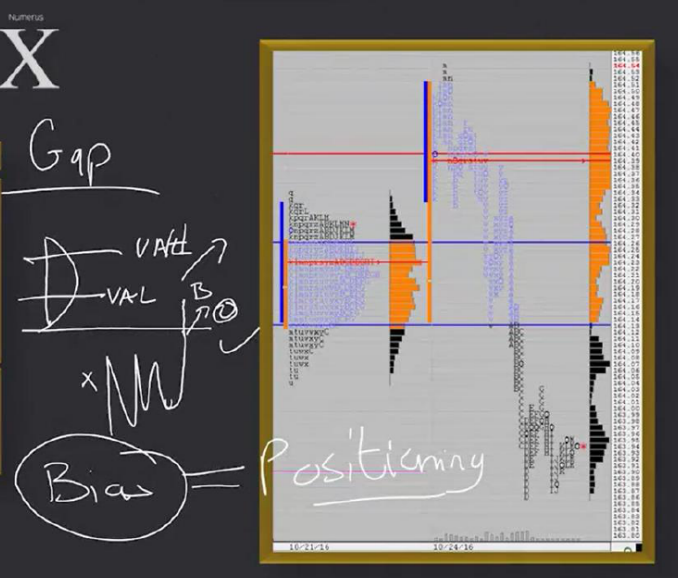
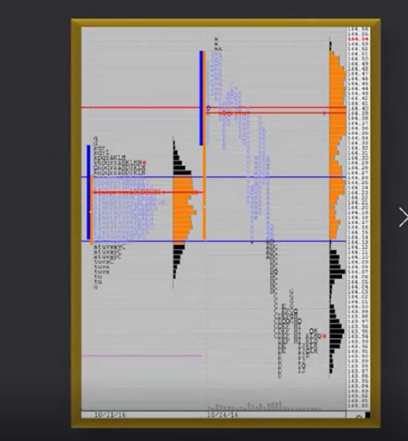

# 📚 CHAPTER 12 — REVERSALS AND STRATEGY 10

## Definition of Reversals

---

### 6 Evaluation Criteria for Reversals

| # | Criterion | What We Look For in Reversals? |
|---|-----------|--------------------------------|
| 1 | **Timeframe players** | Initiative coming from other timeframes |
| 2 | **Initiative / Responsive**| Market positioning is changing |
| 3 | **Time target** | Short-term trend (intraday / a few days) |
| 4 | **Volume and Volatility** | Increase in volume and volatility at reversal |
| 5 | **Risk and Reward** | Strict risk management mandatory (going against the trend!) |
| 6 | **Momentum** | Momentum building in the opposite direction |

> [!CAUTION]
> **Reversals = going AGAINST the prevailing trend.** This is the riskiest group of strategies. Risk management is vital here!

---

## 📚 STRATEGY 10: GAP DAY, FILL DAY



---

## 🧩 Overview

A **GAP** is a price void created when the market opens at a different price than the previous day's close. Strategy 10 looks for trading opportunities by watching **whether this gap will be filled or not**.



```
GAP UP:                             GAP DOWN:

Price ↑                             Price ↑
  |    ★ Today's Open                  |
  |    │                               |  ── Yesterday's High ──
  |    │ GAP (void!)                   |  █████████ Yesterday's VA
  |    │                               |  █████████
  |  ── Yesterday's High ──            |  ── Yesterday's Low ───
  |  █████████ Yesterday's VA          |    │
  |  █████████                         |    │ GAP (void!)
  |  ── Yesterday's Low ───            |    │
  |                                    |    ★ Today's Open
  └────→                               └────→
```

> **Simple Explanation:** Think of a staircase. Normally you go up step by step. But one morning you wake up and find yourself 3 steps up — you never stepped on the stairs in between. That is a GAP. The market skipped those prices without any trading.

---

## 🔑 Reasons for GAP Formation and Outcomes

| Reason | Will the GAP Fill? | Description |
|--------|--------------------|-------------|
| **Fundamental**| ❌ NOT always | Strong news/data → market adapted to a new reality |
| **Technical** | ✅ Usually FILLS | Technical level broken → fills same day or next day |

```
FUNDAMENTAL GAP:                    TECHNICAL GAP:

  ★ Open (central bank decision)      ★ Open (technical resistance broken)
  │                                    │
  │ GAP                                │ GAP
  │                                    │
  ── Yesterday's Close ──              ── Yesterday's Close ──
  
  → GAP might not fill                → GAP will likely fill
  → New trend starting                → Temporary move
  → Be careful!                       → Opportunity!
```

> **Trader's Perspective 🎯:** "Understanding the reason for the GAP is EVERYTHING. Technical GAP = fill opportunity. Fundamental GAP = dangerous, going against trend. Trading a GAP without knowing the reason is gambling."

---

## 📐 3 CRITICAL RULES (Check in Order)

For the GAP fill strategy, you must check 3 rules **in order**:

```
RULE FLOW:

  ┌─────────────────────────────┐
  │ RULE 1: Is the GAP filled?  │
  │ Did price close the void?   │
  └──────────┬──────────────────┘
             │ YES
  ┌──────────▼──────────────────┐
  │ RULE 2: Did it enter the    │
  │ previous day's range?       │
  └──────────┬──────────────────┘
             │ YES
  ┌──────────▼──────────────────┐
  │ RULE 3: Did it enter the    │
  │ previous day's VA?          │  ← THIS IS THE KEY RULE!
  └──────────┬──────────────────┘
             │ YES
  ┌──────────▼──────────────────┐
  │ ★ TRADE ENTRY!             │
  └─────────────────────────────┘
```

### Rule Details

```
                    Yesterday's Profile
Price ↑             
  |    ★ Today's Open (GAP up)
  |    │
  |    │  ← RULE 1: Is GAP filled? (Did price drop here?)
  |  ══════ Yesterday's HIGH ══════
  |    │  ← RULE 2: Did it enter yesterday's range?
  |  ── VA High ──
  |  █████████
  |  █████████  ← RULE 3: Did it enter VA? (KEY RULE!)
  |  █████████
  |  ── VA Low ───  ← TARGET (other VA extreme)
  |  ══════ Yesterday's LOW ══════
```

> [!IMPORTANT]
> **Rule 3 (Entering VA) is the KEY rule of this strategy.** Price can fill the GAP, enter the range — but if it doesn't enter the VA, the strategy is not valid!

---

## 📊 3 SCENARIOS ON A GAP DAY

### Scenario 1: GAP Does Not Fill — Continues

```
  ★ Open (GAP up)
  │ ↗↘↗↘ high volatility
  │     ↗↗↗ Continued!
  │       ↗↗↗
  ══════ Yesterday's HIGH ════
  (GAP never filled ❌)

→ GAP didn't fill, market continued in direction of initiative
→ Formed distribution
→ DO NOT APPLY THIS STRATEGY! ⛔
```

### Scenario 2: Enters Range — Distribution

```
  ★ Open (GAP up)
  │  ↘ fell back
  ══════ Yesterday's HIGH ════
  │  ↗↘↗↘ distribution inside range
  │  ↗↘↗↘
  ── VA High ──
  (Did NOT enter VA ❌)

→ GAP filled, entered range but didn't enter VA
→ Distributing but signal is weak
→ BE CAREFUL, not a full signal
```

### Scenario 3: GAP Filled + Entered Range + Entered VA ✅

```
  ★ Open (GAP up)
  │  ↘ fell back
  ══════ Yesterday's HIGH ════  ← Rule 1 ✅ (GAP filled)
  │  ↘ entered range
  ── VA High ──                 ← Rule 2 ✅ (entered range)
  █████████
  █████★████  ENTRY!            ← Rule 3 ✅ (entered VA)
  █████████
  ── VA Low ──  TARGET 🎯
  ══════ Yesterday's LOW ══════

→ All 3 rules complete → ENTER TRADE!
→ Target: Other extreme of VA (VA Low)
```

---

## 🎯 TRADE ENTRY RULES

### 4 Entry Rules

| # | Rule | Detail |
|---|------|--------|
| 1 | **Enter AFTER 3 rules complete** | GAP filled + entered range + entered VA |
| 2 | **TPO (candle) MUST CLOSE inside VA** | Just touching is not enough, close must be inside VA |
| 3 | **Stop:** Above yesterday's High or below Low | Depending on GAP direction |
| 4 | **Target:** The other extreme of VA | If entered from VA High → VA Low is target (or vice versa) |

### TPO Close Confirmation

```
CORRECT (TPO closed inside VA ✅):    WRONG (just touched ❌):

  ── VA High ──                        ── VA High ──
  │                                    │↘ touched but
  │  ████ TPO close                    │  ↗ went back out
  │  (INSIDE VA!)                      │ (close is OUTSIDE VA!)
  │                                    
  ── VA Low ──                         

→ ENTER TRADE ✅                        → WAIT ❌
```

> **Trader's Perspective 🎯:** "The TPO close is the key to confirmation. Price can just say 'hello' to the VA and leave — that's not enough. It needs to enter the VA and 'sit' there (close)."

### Fundamental GAP Difference

> [!TIP]
> **If the GAP is fundamentally driven and it still fills, the reversal is MUCH STRONGER!**
> 
> Because a fundamental GAP filling means the market found the news "exaggerated". In this case, the reversal is sharp and decisive.

---

## 🏋️ REAL LIFE EXAMPLE

### Scenario: E-mini S&P 500

Let's walk through a realistic market scenario to see how the GAP fill strategy works step by step:

1. **Previous Day's Context:**
   - Yesterday, the market formed a balanced profile.
   - **Value Area High (VAH):** 4120
   - **Value Area Low (VAL):** 4100
   - **Yesterday's High:** 4130
   - **Yesterday's Low:** 4095

2. **The Open (GAP Formation):**
   - Today, the market opens at **4145** due to positive overnight sentiment.
   - This creates a **GAP UP** of 15 points (from yesterday's high of 4130).

3. **The 3 Rules in Action:**
   - **Rule 1 (GAP Filled?):** Sellers step in, and price drops from 4145 down to **4130**. *Rule 1 is met: The GAP is filled.*
   - **Rule 2 (Entered Range?):** The selling pressure continues, and price drops to **4125**. *Rule 2 is met: Price is now inside yesterday's range (4095 - 4130).*
   - **Rule 3 (Entered VA?):** The price continues to fall and hits **4118**. *Rule 3 is met: Price has crossed the VAH (4120) and entered the Value Area!*

4. **Confirmation & Trade Entry:**
   - You wait for the current 30-minute TPO (candle) to finish.
   - The TPO **closes at 4115**, firmly inside the Value Area.
   - **Action:** You enter a **SHORT** trade.
   - **Stop Loss:** Placed just above yesterday's High (e.g., 4132).
   - **Target:** The other extreme of the Value Area (VAL), which is **4100**.

*Result: The market continues its downward rotation through the Value Area and hits the target of 4100, resulting in a successful reversal trade.*

---

## 📝 QUICK SUMMARY

| Topic | Detail |
|------|-------|
| **Strategy Name** | Gap Day, Fill Day |
| **Group** | Reversals |
| **Risk** | HIGH — going against the trend |
| **3 Rules** | 1) GAP filled? 2) Entered range? 3) Entered VA? |
| **Entry** | 3 rules complete + TPO closed inside VA |
| **Target** | The other extreme of VA |
| **Stop** | Above yesterday's High / below Low |
| **Fundamental GAP**| Fills rarely but if it does, strong reversal |
| **Technical GAP** | Usually fills — same day or next day |
| **3 Scenarios** | 1) No fill-continue 2) Range-distribute 3) VA-trade ✅ |

---

## 💡 FINAL NOTES

1. **Investigate GAP reason:** First thing in the morning ask "why is there a GAP?"
2. **Check 3 rules IN ORDER:** Don't skip, be patient
3. **Wait for TPO close:** Don't rush, get confirmation
4. **Risk management #1 priority:** You are going against the trend, your stop must be strict
5. **Fundamental GAP = extra caution:** Might not fill, but huge opportunity if it does

> [!WARNING]
> **GAP trades are dangerous because you are trading against the trend.** Keep your position size small, never remove your stop, and NEVER enter before all 3 rules are met.
