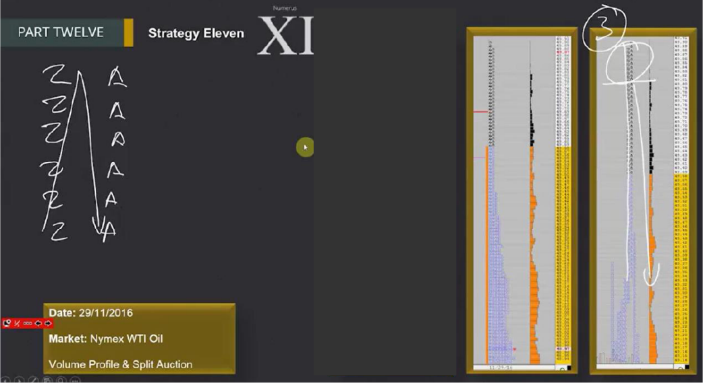
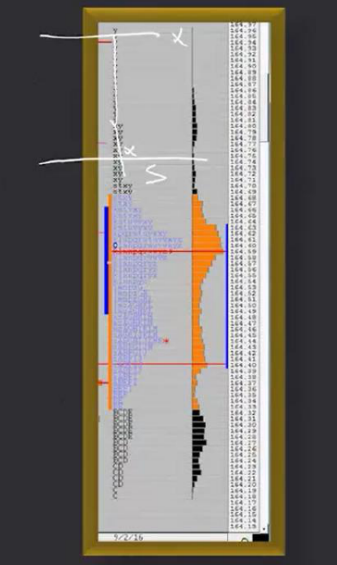
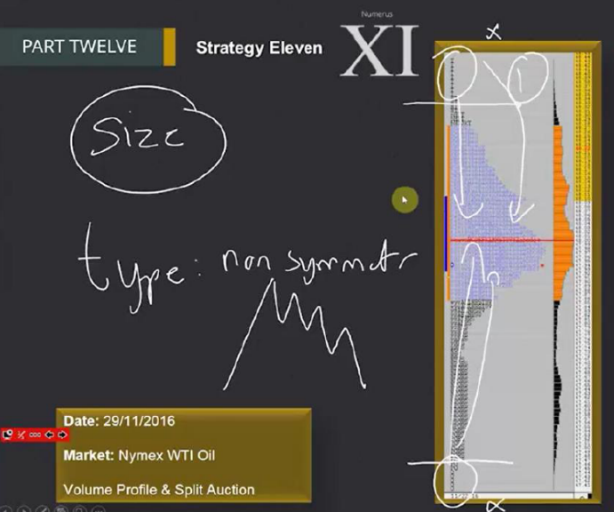

# 📚 CHAPTER 12 — STRATEGY 11

## Strategy 11: Tail Reversal

---

## 🧩 Overview

A **Tail** is single prints in Market Profile showing that price went to a level and was **rapidly rejected**. This indicates that big players from other timeframes **did not accept** that price and pushed the market back.



```
UPWARD TAIL (Sellers rejected):        DOWNWARD TAIL (Buyers rejected):

  A          ← tail (single)            █████████
  A          ← tail (single)            █████████
  AB         ← tail                     █████████
  ABC                                    CBA
  ABCDE                                   BA  ← tail
  ABCDEF   ← main body                    A   ← tail (single)
  ABCDEF                                  A   ← tail (single)
  ABCDE
  
→ Price went up but                     → Price went down but
  sellers pushed it back                  buyers pushed it back
→ SELL signal                           → BUY signal
```



> **Simple Explanation:** Imagine someone trying to force a door open. They opened it a crack, but someone inside forcefully slammed it shut. The "tail" is that opened crack. The wider it was opened (bigger tail), the stronger it was slammed shut.

---

## 🔑 Critical Concepts

### 1. Tail Size = Opportunity Size

> [!IMPORTANT]
> **The bigger the tail, the bigger the opportunity!**

```
SMALL TAIL:                BIG TAIL:

  A                          A
  AB                         A
  ABCD                       A
  ABCDE                      AB
                             ABC
→ 1-2 single prints         ABCDE
→ Weak signal               ABCDEF
→ Small opportunity         
                           → 4-5+ single prints
                           → STRONG signal
                           → BIG opportunity
```

### 2. Three Types of Tails

| Type | Description | Appearance |
|------|-------------|------------|
| **Tail** | Multiple single prints | Clear, visible |
| **Single TPO** | Only one print in a single period | Smaller but valid |
| **Hidden TPO** | Hidden, single print not visible at first glance | Requires careful analysis |

### 3. Symmetrical vs Asymmetrical Tail

This distinction determines **entry aggressiveness**:



```
SYMMETRICAL TAIL:                   ASYMMETRICAL TAIL:

Price ↑                             Price ↑
  |    A                               |    A
  |    A                               |    A
  |    AB                              |    AB
  |    ABC                             |    ABCD
  |   ABCDE                            |    ABCDEF
  |   ABCDE  ← Body is symmetrical     |   ABCDEFG
  |    ABC                             |    BCDE     ← Body is asymmetrical
  |    AB                              |     BCD
  |    A                               |      BC
  |    A                               |       B
  |                                    |
  
→ Tail AND body are balanced         → Tail on one side, body on the other
→ Strong rejection signal            → Less clear rejection
→ AGGRESSIVE entry ✅                 → PASSIVE entry ⚠️
```

> **Trader's Perspective 🎯:** "A symmetrical tail speaks to you clearly: 'This price was rejected, go!' An asymmetrical tail whispers: 'Maybe it was rejected, but I'm not sure.' Treat them differently."

---

## ⏰ CANDLE CLOSE CONFIRMATION

> [!CAUTION]
> **You MUST WAIT FOR THE CANDLE (TPO) TO CLOSE to confirm the tail!**
> 
> A tail is not considered formed until the candle closes. Price can revert and the tail can disappear.

```
CANDLE OPEN (WAITING):              CANDLE CLOSED (CONFIRMED!):

  A   ← looks like a tail            A   ← tail CONFIRMED ✅
  A                                   A
  AB                                  AB
  ABC  ← candle still open...        ABC
       price can go back up          ABCD ← candle closed, tail
       again! ❌                            is valid!

→ WAIT!                             → YOU CAN ENTER!
```

---

## 🎯 TRADE ENTRY RULES

### Symmetrical Tail — AGGRESSIVE Entry

```
SYMMETRICAL TAIL IDENTIFIED:

Price ↑
  |    A  ← top of tail (STOP is here)
  |    A
  |    AB
  |    ABC
  |   ABCDE  ← body
  |   ABCDE
  |    ABC
  |    ★ Candle closed, 2nd candle opened → AGGRESSIVE ENTRY (SHORT)
  |      ↘↘↘ move in reverse direction
  |
  └──────────────────────→ Time
```

| Feature | Detail |
|---------|--------|
| **Entry time** | As soon as TPO closes, when 2nd candle opens |
| **Entry type** | **AGGRESSIVE** — market order |
| **Stop Loss** | **Above/below** the highest/lowest price of the tail |
| **Stop management**| Use **trailing stop** OR move stop when market shows aggressive initiative |
| **Exit** | Stay until aggressive buyer/seller enters in opposite direction |

### Asymmetrical Tail — PASSIVE Entry

```
ASYMMETRICAL TAIL IDENTIFIED:

Price ↑
  |    A  ← top of tail (STOP is here — DO NOT MOVE!)
  |    A
  |    AB
  |    ABCD
  |    ABCDEF ← body (asymmetrical)
  |     BCDE
  |      BCD
  |       ★ Entry (PASSIVE — limit order)
  |         ↘ slow movement
  |           ↘ slow continuation
  |
  └──────────────────────→ Time
```

| Feature | Detail |
|---------|--------|
| **Entry time** | After the tail is confirmed |
| **Entry type** | **PASSIVE** — limit order |
| **Stop Loss** | Above/below tail — **LEAVE AT ORIGINAL POSITION** |
| **Stop management**| DO NOT MOVE stop until market shows "irreversible move" |
| **Move speed** | SLOWER than symmetrical |
| **Exit** | Stay until aggressive buyer/seller enters |

> [!WARNING]
> **Do not move the stop early on an asymmetrical tail!** The move will be slow, price will make pullbacks. Keep the stop at its original place — only move it when the market shows a clear "irreversible" move.

### Symmetrical and Hidden Tail — Special Rule

```
Candle 1 closed → tail confirmed ✅
Candle 2 opened → IMMEDIATELY enter AGGRESSIVE in reverse direction!

  Candle 1:     Candle 2:
  A (tail)       
  A              
  AB             
  ABC            C
  ABCDE          CD
  ABCDE          CDE  ← 2nd candle opened, enter!
       ↓         CDEF
  CLOSED        CDEFG ↘ continues reverse direction
```

---

## 📊 SYMMETRICAL vs ASYMMETRICAL COMPARISON

| Feature | Symmetrical | Asymmetrical |
|---------|-------------|--------------|
| **Signal strength**| ⭐⭐⭐⭐⭐ Very strong | ⭐⭐⭐ Medium |
| **Entry** | Aggressive (market order) | Passive (limit order) |
| **Move speed** | Fast | Slow |
| **Stop management**| Trailing stop / move | Keep at original place |
| **Stop move time** | When aggressive init. seen | When irreversible move seen |
| **Reliability** | High | Medium |

---

## 📝 QUICK SUMMARY

| Topic | Detail |
|------|-------|
| **Strategy Name** | Tail Reversal |
| **What do we look for?** | Tail, single TPO, or hidden TPO |
| **Size rule** | Big tail = big opportunity |
| **Confirmation** | WAIT for candle (TPO) close |
| **Symmetrical** | Aggressive entry, trailing stop, fast move |
| **Asymmetrical** | Passive entry, fixed stop, slow move |
| **Entry (symm)** | Aggressive at 2nd candle open (market order) |
| **Entry (asymm)** | Passive after confirmation (limit order) |
| **Stop** | Beyond extreme price of the tail |
| **Exit** | Stay until aggressive reverse side enters |

---

## 💡 FINAL NOTES

1. **Candle close is sacred:** No tail until it closes. Be patient
2. **Size matters:** 1-2 tick tail is weak, 4-5+ tick tail is strong
3. **Make symm/asymm distinction correctly:** This determines your aggression level
4. **Be patient on asymmetrical:** Move will be slow, don't move stop early
5. **Don't miss Hidden TPOs:** Might not be visible at first glance, analyze carefully

> [!TIP]
> **Look at the end-of-day profile every day and mark the tails.** Prepare tomorrow's trade opportunities today. Profiles with big tails draw a roadmap for the next day.
