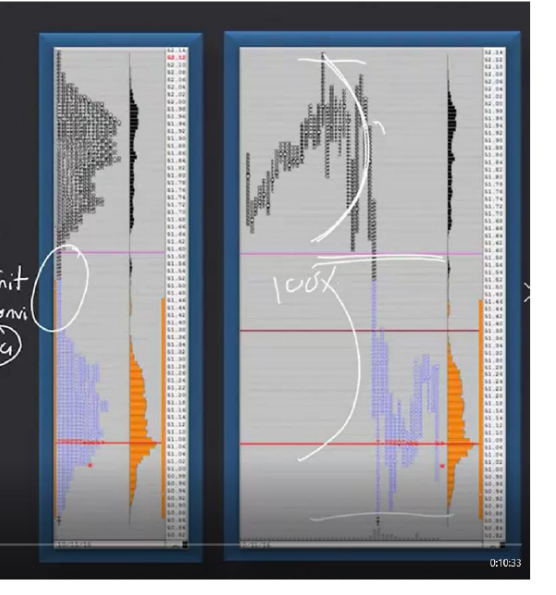
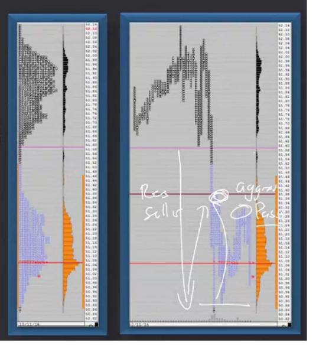
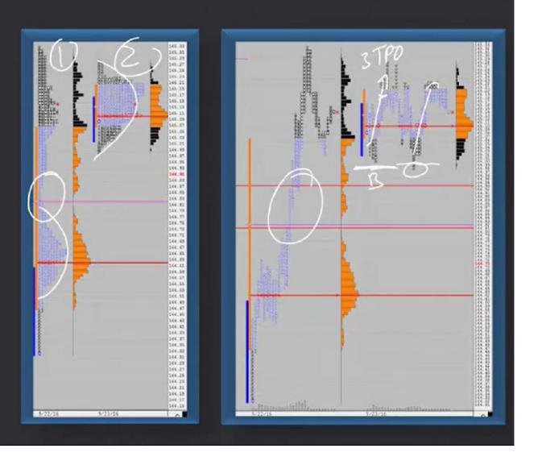
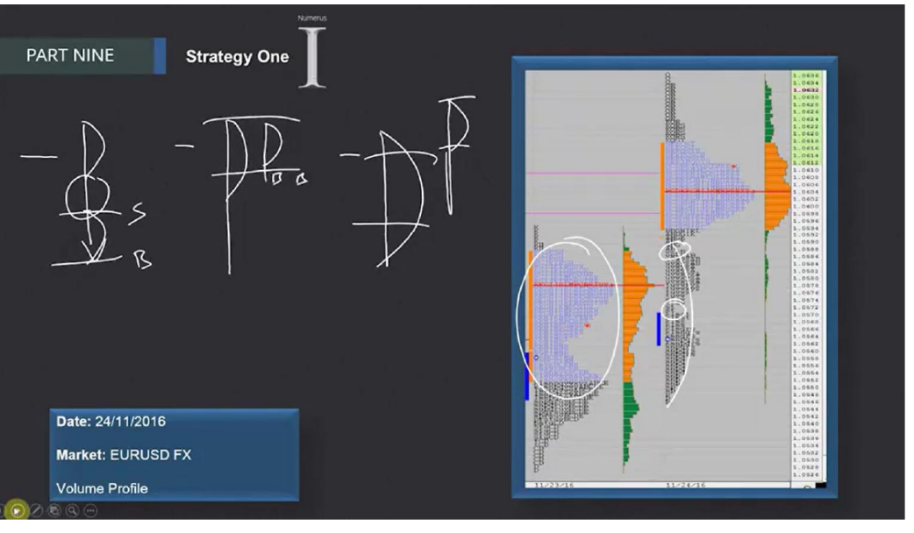

# 📚 CHAPTER 9 — ANOMALY STRATEGIES

## Strategy 1: Low Volume Area (LVA)

---

## 🧩 Overview

This chapter is about **"Anomaly Strategies"**. An anomaly represents **abnormal situations** in the market. These strategies consist of two main topics:

| # | Strategy | Description |
|---|----------|-------------|
| 1 | **Low Volume Area (LVA)** | Areas where price passes quickly, with low trading activity |
| 2 | **Double Distribution** | The formation of two separate value areas |

In this lesson, we will deeply learn **Strategy 1: LVA**.

---

## 📋 Framework of Strategy 1

When building an LVA strategy, we need to define the following elements:

| Element | Description |
|---------|-------------|
| **Name** | Low Volume Area (LVA) |
| **Characteristics**| How it looks, what it means |
| **Rules and Prerequisites**| When it is valid |
| **Money Management (Risk)**| Stop and target levels |
| **Trade Execution** | How to enter |
| **Expectation Analysis and Emotions**| What to expect, how to manage |
| **Continuous Evaluation**| Observations during the trade |

> [!IMPORTANT]
> You must fill out this framework for every strategy. This is the **systematic approach** that saves you from random trading.

---

## 🔑 Critical Concepts

### 1. What is a Single Print?

**Single Print** refers to levels on the Market Profile chart where price was **visited only once**. Meaning, very little trading occurred at that price.

```
Imagine a market profile:

    A
    AB
    ABC
    ABCD        ← High volume area (frequent visits)
    ABCDE       ← High volume area
     BCDE       ← High volume area
      C         ← 🔴 SINGLE PRINT! (single letter = single visit)
      C         ← 🔴 SINGLE PRINT!
      CD
      CDE
      CDEF      ← High volume area (new value area)
      CDEFG
       DEFG
```

> **Simple Explanation:** Imagine a crowded street. Places where everyone stops and shops = **high volume area**. A narrow passage where everyone runs through and no one stops = **single print / low volume area**.

### 2. What is an LVA (Low Volume Area)?

LVA is a low-volume zone **created by single prints**. Price has **passed through this zone rapidly**, meaning buyers or sellers did not stay here for long.

> **Trader's Perspective 🎯:** LVA is where the market says "this price level is unfair, I don't want to trade here". This indicates that large players have made a strong directional decision.

### 3. Trade Location: In Balance or Out of Balance?

| Status | Description | Example |
|--------|-------------|---------|
| **In Balance** | Price is within the previous day's value area | Price is wandering in yesterday's Value Area |
| **Out of Balance** | Price has moved outside the previous day's value area | Price broke above/below yesterday's VA |

> [!TIP]
> The LVA strategy works most powerfully in **out of balance** situations. Because out of balance = strong initiative = directional movement.

---

## 📐 RULES AND PREREQUISITES OF THE STRATEGY

### ✅ Checklist

Check these items before entering a trade:

### 1️⃣ Evaluate Trade Location
- Is price **in balance** or **out of balance**?
- Out of balance = more reliable signal

### 2️⃣ Single Prints Creating LVA
- Are there **single-letter** levels on the market profile?
- Do these levels create a **gap/passage**?

### 3️⃣ Size of Single Prints
- **How wide** is the single print area?
- ⚠️ **Wider = Larger initiative = Stronger signal**

```
Narrow Single Print:     Wide Single Print:
                         
    ABCD                     ABCDE
     B      ← narrow          B      
     B                        B      
    BCD                       B      ← WIDE (very strong!)
    BCDE                      B      
                              B      
                             BCDE    
                             BCDEF   
```

### 4️⃣ Seeing an Increase in Volume and Volatility
- When LVA is broken, there must be a **noticeable increase in volume**
- **Volatility must rise** (price movements must become larger)
- Do not enter the trade without this!

### 5️⃣ Expecting 100% Extension
- When the breakout occurs, we expect price to make **at least a 100% extension**

```
Example: 100% Extension Calculation

Value Area 1:  100 - 110  (10-point area)
Single Print:  110 - 111  (LVA zone)
Value Area 2:  111 - 120

If price breaks up:
→ Size of first value area = 10 points
→ 100% extension = 10 points up from breakout point
→ Target: 120 + 10 = 130
```



### 6️⃣ Understand Why the LVA Formed
| Reason | Description | Reliability |
|--------|-------------|-------------|
| **Fundamental** | News, data, central bank decision | ⭐⭐⭐⭐⭐ Very strong |
| **Technical** | Support/resistance breakout, technical pattern | ⭐⭐⭐⭐ Strong |

### 7️⃣ Do Not Fade the Main Trend!

> [!CAUTION]
> **When there is such a strong initiative, DO NOT STAND AGAINST THE MAIN TREND DIRECTION!**
> 
> If the market is aggressively going down and an LVA formed downward, **DO NOT open a LONG (buy) trade!**

---

## 🎯 TRADE ENTRY METHODS



### Trade Entry 1: Aggressive Entry (First Pullback)

```
TIMELINE →

Price
 ↑
 |     ___
 |    |   |  Value Area 1
 |    |___|
 |      |     ← Single Print (LVA)
 |      ↓ 
 |     FAST DROP (Initiative move)
 |           ↗ First Pullback 
 |          / 
 |    ★ ENTRY POINT (in front of single print)
 |         \
 |          ↘ Continues (towards target)
 |
 └─────────────────────→ Time
```

| Feature | Detail |
|---------|-------|
| **When?** | AFTER the market shows initiative |
| **Where?**| On the first pullback, in front of the single print |
| **How?** | **Aggressive** — most likely with a **market order** |
| **Stop Loss**| **Above** (for sell) or **below** (for buy) the single print |

> **Trader's Perspective 🎯:** "The market has shown you its direction, it's moving fast. Jump in the moment it takes its first breath! There is no time to wait, so you use a market order."

### Trade Entry 2: Passive Entry (Second Pullback)

```
TIMELINE →

Price
 ↑
 |     ___
 |    |   |  Value Area 1  
 |    |___|
 |      |     ← Single Print (LVA)
 |      ↓
 |    DROP
 |         ↗ 1st Pullback
 |        / 
 |       ↘ Continues
 |            ↗ 2nd Pullback (can be a lower or higher rotation)
 |           /
 |     ★ ENTRY POINT (with limit order)
 |          \
 |           ↘ Continues
 |
 └─────────────────────→ Time
```

| Feature | Detail |
|---------|-------|
| **When?** | AFTER the first pullback |
| **Where?**| On the second pullback, a lower/higher rotation compared to previous pullback |
| **How?** | **Passive** — most likely with a **limit order** |
| **Stop Loss**| **Above/below** the single print |

> **Trader's Perspective 🎯:** "If you missed the first opportunity or want a better price, wait for the second pullback. This time you enter more comfortably — you place a limit order and wait."

---

## ⚠️ CRITICAL WARNINGS FOR BOTH ENTRIES

### Expectations:
- ✅ The market **must move rapidly in the direction of the initiative**
- ✅ We must see **aggressive buyers or sellers** (large volume orders)
- ✅ The movement **must be fast and decisive**

### Danger Signals:

> [!WARNING]
> **If the market starts to consolidate** (meaning price gets stuck in a narrow range), this is a sign that the strategy **might fail!**
> 
> Consolidation = weakening of initiative = EXIT THE TRADE or be careful!

### ⏰ The 3 TPO Rule

> [!IMPORTANT]
> **The total expected movement MUST occur within a MAXIMUM of 3 TPOs!**
> 
> If the market does not reach the target within this time → **EXIT THE TRADE!**

**What is a TPO?** TPO (Time Price Opportunity) represents every 30-minute period in Market Profile. So 3 TPOs = **90 minutes** (1.5 hours).



```
Example:
- You entered a trade at 10:00 (Sell)
- At 10:30 — 1st TPO: Price dropped a bit ✅
- At 11:00 — 2nd TPO: Price continues to drop ✅
- At 11:30 — 3rd TPO: Price still hasn't reached target ❌ → EXIT!

Why? Because this strategy relies on FAST movement.
If it takes more than 3 TPOs, the initiative has weakened.
```

---

## 📊 3 DIFFERENT LVA TYPES



### Type 1: Aggressive Movement with Massive Initiative

```
     ████████
     ████████   Value Area 1
     ████████
        |
        |       ← Single Print (NARROW PASSAGE)
        |
        ↓↓↓↓↓   MASSIVE AGGRESSIVE DROP
     ████████
     ████████   Value Area 2 (new)
     ████████
```

- **Strongest** LVA type
- Very clear, very fast movement
- Reliability: ⭐⭐⭐⭐⭐
- Usually forms after a major news or event

> **Trader's Perspective 🎯:** "This is a golden opportunity. The market is screaming at you: 'I'm going this way!' Don't miss it."

---

### Type 2: Previous P or b Profile

```
"P" Profile:              "b" Profile:
(Buying pressure)         (Selling pressure)
                           
  ████████  ← wide top       |
  ████████                   |
     |                    ████████ ← wide bottom
     |      ← narrow bot  ████████
```

- The previous day formed a **P profile** (wide top, narrow bottom) or **b profile** (wide bottom, narrow top)
- We look for buy or sell opportunities in the **value area** inside this profile
- Reliability: ⭐⭐⭐⭐

> **Simple Explanation:**
> - **P profile** = Buyers are strong, price consolidated at the top → look for potential sell opportunity
> - **b profile** = Sellers are strong, price consolidated at the bottom → look for potential buy opportunity

---

### Type 3: Out of Value in the Overnight Session

```
INTRADAY:                   OVERNIGHT SESSION:
                             
  ████████                      ↗ Price went up
  ████████  Value Area          |
  ████████                    ████
  ████████                    ████ (out of value!)
```

- The previous day price was **inside the value area** (in balance)
- **During the overnight session**, price moved outside the value area
- **Least reliable** LVA type
- Reliability: ⭐⭐⭐

> [!NOTE]
> We trade this type of LVA with **less confidence** because the overnight session is usually lower volume and can reverse at the morning open.

> **Trader's Perspective 🎯:** "The overnight session gives us a clue, but when the big players sit at the table at the morning open, everything can change. If you're going to trade this type, reduce your position size."

---

## 📝 SUMMARY TABLE

| Topic | Detail |
|------|-------|
| **Strategy Name** | Low Volume Area (LVA) |
| **What do we look for?** | Low volume zones created by single prints |
| **Prerequisites** | Out of balance location, wide single print, volume/volatility increase |
| **Entry 1** | Aggressive — on the first pullback, market order |
| **Entry 2** | Passive — on the second pullback, limit order |
| **Stop Loss** | The other side of the single print |
| **Target** | Minimum 100% extension |
| **Time Limit** | Maximum 3 TPOs (90 minutes) |
| **Danger** | Consolidation = strategy may fail |
| **Golden Rule** | DO NOT fade the main trend! |

---

## 💡 FINAL NOTES — THE TRADER'S MINDSET

1. **Be patient but decisive:** Wait for LVA to form, but act quickly when it does
2. **Use your checklist:** Check all prerequisites before every trade
3. **Manage your emotions:** Initiative moves are exciting, but stick to your rules
4. **Never forget the 3 TPO rule:** Time can be your enemy — if the market isn't moving in 90 minutes, your plan is wrong
5. **Spot consolidation early:** If the market slows down and gets squeezed, get out while the loss is small
