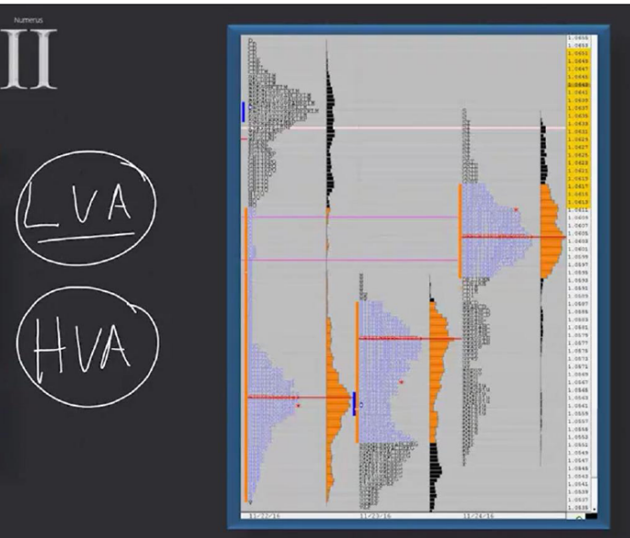
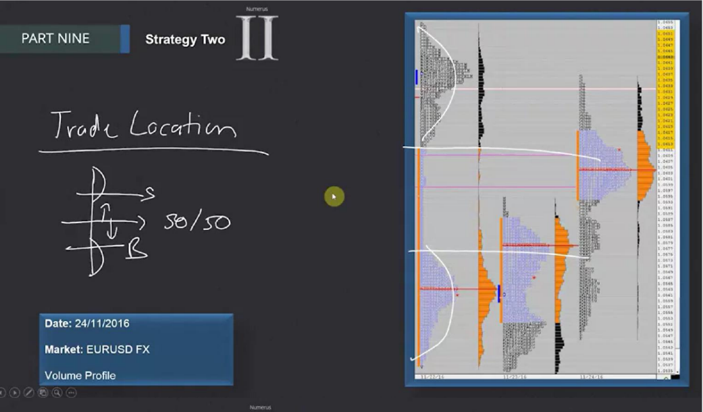
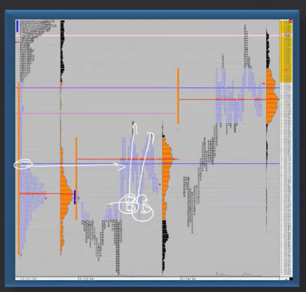
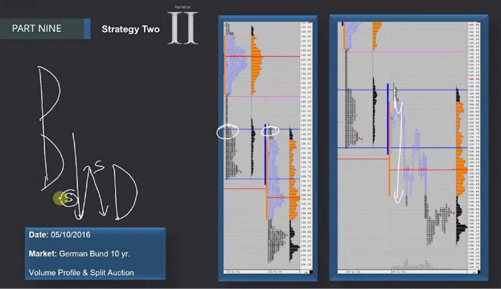

# 📚 CHAPTER 9 — ANOMALY STRATEGIES

## Strategy 2: Filling the LVA (LVA → HVA Transition)

---

## 🔗 Connection with Strategy 1

This strategy is the **natural continuation of Strategy 1.** In Strategy 1, the market made a strong initiative move by creating an LVA (Low Volume Area). **In Strategy 2, the market turns back and begins to fill that LVA.**

```
STRATEGY FLOW:

Strategy 1 (LVA)                    Strategy 2 (Filling the LVA)
─────────────────                    ────────────────────────────
                                     
  ████ HVA (Upper)                     ████ HVA (Upper)
     |                                 ████████████  ← being filled!
     |  Single Print (LVA)             ████████████  ← being filled!
     |                                 ████████████  ← being filled!
  ████ HVA (Lower)                     ████ HVA (Lower)

→ Price passed rapidly              → Price comes back and fills the gap
→ Initiative move                    → 2-way trade
→ ONE-WAY                           → TWO-WAY
```

> [!IMPORTANT]
> **The Moment of Transition:** The moment the market starts filling the LVA, we switch from Strategy 1 to Strategy 2. This is the moment **the rules of the game change**. We stop thinking one-way and switch to a two-way trading logic.

---

## 🔑 Critical Concepts



### What is an HVA (High Volume Area)?

HVA represents zones where the market **traded heavily and price stayed for a long time**. They are the parts that look "bulging" on the Volume Profile. These can be thought of as **"domes"** located on both sides of the LVA.

```
Volume Profile View:

Price ↑
  |
  |    ██████████  ← UPPER HVA (Dome 1)
  |    ████████
  |    ██████
  |      ██        ← LVA (narrow zone, low volume)
  |      █
  |    ██████
  |    ████████
  |    ██████████  ← LOWER HVA (Dome 2)
  |
  └───────────→ Volume
```

> **Simple Explanation:** Imagine a narrow passage (LVA) connecting two hills (HVA). In Strategy 1, price ran through this passage. Now in Strategy 2, price comes back and slowly widens this passage — it bounces back and forth between the two hills.

### What is a 2-Way Trade?



Saying an LVA is being filled means an environment is forming where price **moves both up and down**. In this case:

| Direction | Opportunity |
|-----------|-------------|
| **At Lower HVA** | Look for BUY opportunities 🟢 |
| **At Upper HVA** | Look for SELL opportunities 🔴 |

> **Trader's Perspective 🎯:** "Stop thinking one-way! The market is playing ping-pong between two domes. Buy at the lower dome, sell at the upper dome."

---

## ⏰ THE TIME FACTOR

The process of filling an LVA can occur in **different timeframes**:

| Duration | Description | Reliability |
|----------|-------------|-------------|
| **Same day** | Begins to fill on the day the LVA was formed | ⭐⭐⭐⭐⭐ Most reliable |
| **Next day** | Filling starts on the next trading day | ⭐⭐⭐⭐ Reliable |
| **Following days**| Filling occurs a few days later | ⭐⭐⭐ Less reliable |

> [!NOTE]
> The longer the time extends, the lower the probability of the LVA being completely filled may become. However, even a **partial fill** can offer trading opportunities.

---

## 📐 THE FILLING PROCESS: TWO DIFFERENT SCENARIOS

### Scenario A: Slow Filling

Price progresses from one dome (HVA) to the other **slowly, step by step**.

```
TIME →

Price ↑
  |
  |    ████  UPPER HVA
  |     ↗
  |    ↗         ← Slow, gradual filling
  |   ↗
  |  ↗
  |    ████  LOWER HVA
  |
  └─────────────→
```

- Price fills the LVA zone with small steps
- A little more volume is added with each step
- **Less aggressive** trade entries are suitable
- Working with limit orders makes sense

### Scenario B: Aggressive Filling

Price goes directly to the other HVA with **massive initiative**, then returns and continues to fill.

```
TIME →

Price ↑
  |
  |    ████  UPPER HVA  ←── Price reached here rapidly
  |     |              ↙
  |     ↓    ← Then turned back  
  |    ↗↘   ← And bounced back and forth (rotation)
  |   ↗  ↘
  |    ████  LOWER HVA
  |
  └─────────────→
```

- Price first goes rapidly from one HVA to the other
- Then returns and fills the LVA by **rotating**
- **More aggressive** trade entries are possible
- Can work with market orders

> **Trader's Perspective 🎯:** "Look at how the filling started. Is it coming slowly? Place a limit order, be patient. Is it coming like a rocket? Then be more aggressive but keep your stop tight."

---

## 🎯 TRADE ENTRY RULES

### Buy Opportunities (Long)



```
Price ↑
  |
  |    ████████  UPPER HVA  ← 🔴 SELL Here
  |    ████████
  |
  |    ████████  ← LVA being filled
  |
  |    ████████  LOWER HVA   ← 🟢 BUY Here
  |    ████████
  |
```

- We look for buy opportunities in the **Lower HVA zone**
- We enter on the **1st and 2nd pullbacks**
- Price will rise from lower HVA to upper HVA

### Sell Opportunities (Short)

- We look for sell opportunities in the **Upper HVA zone**
- Price will drop from upper HVA to lower HVA

### Entry Details

```
Example: Buy at Lower HVA

Price ↑
  |
  |    ████  UPPER HVA  ← TARGET (Take Profit)
  |      |
  |      |   LVA (being filled)
  |      |
  |    ████  LOWER HVA
  |      |
  |      ↗ 1st Pullback → ★ ENTRY 1
  |     ↗↘ 
  |        ↗ 2nd Pullback → ★ ENTRY 2
  |
  |  ───────── Breakout line
  |    STOP ↓  (below the breakout line)
  |
```

---

## 📊 RISK MANAGEMENT

### Stop Loss Placement

| Position | Stop Loss Location |
|----------|--------------------|
| **Buy (Long)** | **BELOW** the breakout line |
| **Sell (Short)** | **ABOVE** the breakout line |

### Risk/Reward Ratio

> [!IMPORTANT]
> **This strategy operates with a 1:1 Risk/Reward ratio!**
> 
> This is different from Strategy 1. In Strategy 1 we expected a 100% extension (higher R/R). Here, since the market is bouncing between two HVAs, **our target is the opposite HVA**, and risk/reward is usually 1:1.

```
Example: 1:1 R/R Calculation

Lower HVA:      100
Upper HVA:      110
Breakout line:  98

★ Buy entry:    100 (At Lower HVA)
✋ Stop Loss:     98  (below breakout line) → Risk = 2 points
🎯 Target:       102 (At 1:1 ratio) → Reward = 2 points

OR if you target the exact opposite HVA:
🎯 Target:       110 → Reward = 10 points (but this is not guaranteed!)
```

> **Trader's Perspective 🎯:** "A 1:1 R/R might seem low, but this strategy has a **high hit rate**. The market has already entered filling mode, this tells you the direction. If you win 6-7 out of 10 trades, you make money even with a 1:1 R/R."

---

## ❌ FAILURE SCENARIO: If LVA Filling Fails



The market may not always fill the LVA. Sometimes price begins to reverse but **fails** and continues in the direction of the original initiative.

```
Failed Filling Scenario:

Price ↑
  |
  |    ████  UPPER HVA
  |      |
  |      |   LVA
  |      |
  |    ████  LOWER HVA
  |      |
  |      ↗ Filling attempt (failed!)
  |     ↗
  |    ↗ ← Price couldn't fill the LVA
  |   ↘
  |  ↘↘↘ ← Continues in initiative direction (breakout down!)
  |
  | ★ ENTER ON FIRST PULLBACK (in breakout direction)
  |
```

### What to Do in This Case?

> [!WARNING]
> If LVA filling fails, **change the plan!** Strategy 2 is now invalid — revert back to **Strategy 1 logic**.

| Step | Action |
|------|--------|
| 1 | Realize the filling has failed |
| 2 | Close the current position (might have hit stop) |
| 3 | Wait for the **first pullback** in the breakout direction |
| 4 | Enter a new trade in the breakout direction |

```
Example:

Situation: You bought at Lower HVA thinking price would fill LVA
           but price broke below the Lower HVA!

1. Your stop was already below the breakout line → you exited automatically
2. Price made a downward breakout
3. Wait for the first pullback (let price pull back slightly)
4. Open a SELL position (in breakout direction)
5. Stop: Above the breakout line
```

> **Trader's Perspective 🎯:** "Don't be stubborn when the market tells you 'no, I won't fill it'. Change the plan and join the direction the market is going. This flexibility keeps you alive."

---

## 📝 QUICK SUMMARY TABLE

| Topic | Detail |
|------|-------|
| **Strategy Name** | Filling the LVA (LVA → HVA Transition) |
| **Connection** | Continuation of Strategy 1 |
| **What do we look for?**| LVA beginning to be filled |
| **Trade type** | 2-way trade (both directions) |
| **Where to buy?** | In Lower HVA zone, on 1st and 2nd pullbacks |
| **Where to sell?** | In Upper HVA zone |
| **Stop Loss** | Below/above the breakout line |
| **R/R Ratio** | 1:1 |
| **Time** | Same day, next day, or following days |
| **Failure** | If price cannot fill → trade in breakout direction (return to Str.1) |

---

## 💡 FINAL NOTES — THE TRADER'S MINDSET

1. **Be flexible:** Make the transition from Strategy 1 to 2 in time. The market tells you when it will change — listen!
2. **Think two-ways:** If the LVA is filling, stop saying "I'm only selling" or "I'm only buying". There are opportunities in both directions.
3. **Don't underestimate a 1:1 R/R:** With a high hit rate, even 1:1 can be very profitable. The key is to make disciplined exits.
4. **Pay attention to location:** Don't do the opposite by selling at lower HVA and buying at upper HVA! Location is everything.
