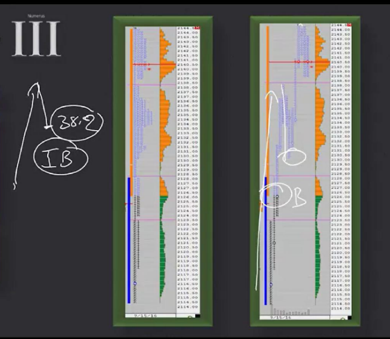

# 📚 CHAPTER 10 — STRATEGY 3

## Strategy 3: The Open Drive

---

## 🧩 Overview

**The Open Drive** is when the market moves by **taking strong initiative in one direction** right at the open. Price proceeds in one direction from the opening price **without turning back**. This indicates that big players made a clear decision at the open.

```
NORMAL OPEN:                      OPEN DRIVE:

Price ↑                           Price ↑
  |     ↗↘                          |         ↗
  |   ↗    ↘                        |       ↗
  |  ★ open   ↗↘                    |     ↗
  |          ↗                       |   ↗
  |                                  |  ★ open (didn't turn back!)
  └────────────→ Time                └────────────→ Time

→ Price goes back and forth        → Price goes in ONE DIRECTION
→ Indecisive market                  right from the open
                                   → Decisive, strong initiative
```

> **Simple Explanation:** Think of a race. At a normal start, runners go back and forth a bit — they warm up. But in an Open Drive, as soon as the gun fires, the runner **sprints full throttle**, not even looking back. That is exactly what the market does.

---

## 🔑 Critical Concepts



### 1. The Opening Price (Open Price) — THE ABSOLUTE LINE

> [!CAUTION]
> **The opening price is an ABSOLUTE line and MUST NOT BE TESTED!**
> 
> If price returns and tests the opening price, the Open Drive strategy becomes **invalid**. In this case, Long or Short trades made based on the opening price can be **rejected**.

```
VALID OPEN DRIVE:                INVALID (Open was tested):

Price ↑                           Price ↑
  |       ↗ continues                |       ↗
  |     ↗                            |     ↗
  |   ↗                              |   ↗
  |  ★ OPEN                          |  ★ OPEN
  |  ║ (price did NOT                |   ↘ ← price came back!
  |  ║  RETURN here! ✅)             |    ↘ TESTED the open ❌
  |                                   |   ↗ then rose again
  └────────→                          └────────→
  
  → STRATEGY VALID                 → STRATEGY INVALID!
```

> **Trader's Perspective 🎯:** "The opening price is your red line. If price returns there, it means big players aren't confident in their decisions. Forget the trade then."

### 2. What is Initial Balance (IB)?

**Initial Balance (IB)** is the trading range of the market's **first 1 hour** (usually the first 2 TPOs — A and B periods).

```
Time    TPO    Price Range
─────   ───    ─────────────
09:30    A     2150 - 2155     ┐
10:00    B     2148 - 2157     ┘ ← INITIAL BALANCE = 2148 - 2157

10:30    C     2155 - 2162     → Went above IB (IB breakout!)
11:00    D     2160 - 2168
```

| IB Term | Meaning |
|---------|---------|
| **IB High** | The highest price in the first 1 hour |
| **IB Low** | The lowest price in the first 1 hour |
| **IB Range** | The distance between IB High − IB Low |
| **IB Breakout**| Price moving above IB High or below IB Low |

> **Why IB is important in Open Drive:** Open Drive usually starts during the IB period. If price moves in one direction from the open, one side of the IB (high or low) will be very close to the opening price.

### 3. Fibonacci 38.2% Retracement Reference

We use the **38.2% Fibonacci level** as a reference to measure the depth of the first pullback following an Open Drive.

```
Fibonacci Retracement Levels:

Top of the Move ─── 100% ────────────────
                  │
                  │   23.6%  (shallow pullback)
                  │
                  │   38.2%  ← ★ OUR REFERENCE LEVEL
                  │
                  │   50.0%  ← STOP level
                  │
                  │   61.8%  (deep pullback)
                  │
Bottom of Move ──── 0% ──────────────────
```

```
EXAMPLE CALCULATION:

Opening price (Low):    2150
Peak of the day:        2170
Move size:              20 points

38.2% retracement = 2170 - (20 × 0.382) = 2170 - 7.64 = 2162.36
50.0% retracement = 2170 - (20 × 0.50)  = 2170 - 10   = 2160.00

★ Buy entry:    Around ~2162 (38.2%)
✋ Stop Loss:     2160 (Below 50%)
```

> **Trader's Perspective 🎯:** "38.2% is not a magic number, but in strong trends pullbacks are usually shallow. If price goes beyond 50%, it's no longer a 'pullback', it could be a 'reversal'."

---

## 🎯 TRADE ENTRY RULES

### Entry: On the First Pullback

```
UPWARD OPEN DRIVE — BUY (Long):

Price ↑
  |                    PEAK
  |                   ╱
  |                 ╱
  |               ╱
  |             ╱
  |           ╱     ← Open Drive (strong uptrend)
  |         ╱
  |       ╱
  |  ★ OPEN
  |              ╲
  |                ╲    ← 1st Pullback (retracement)
  |                  ★ ENTRY (Around 38.2%)
  |           ─ ─ ─ ─ ─ 50% level (STOP)
  |
  └────────────────────────────→ Time
```

### Checklist

| # | Check | Detail |
|---|-------|--------|
| 1 | ✅ Is there an Open Drive? | One-way, strong move right from the open |
| 2 | ✅ Was open price untested?| Price did NOT turn back and touch the open |
| 3 | ✅ Did 1st pullback start? | Price is making its first retracement |
| 4 | ✅ Approached 38.2% level? | Is the pullback shallow? |
| 5 | ✅ Is there new initiative?| Does momentum reappear after the pullback? |

### Pay Special Attention To:

> [!IMPORTANT]
> **New buyer/seller initiative must appear during the pullback!**
> 
> Do not enter blindly just because it reached 38.2%. At that level, **new aggressive buyers** (for an upward drive) or **new aggressive sellers** (for a downward drive) must appear.

```
GOOD PULLBACK (Enter ✅):            BAD PULLBACK (Wait ❌):

  ↑ Drive                              ↑ Drive
  ↓ Pullback                           ↓ Pullback
  │                                     ↓ Pullback continues...
  ★ New buyers arrive at 38.2%!        ↓ No buyers, price is dropping
  ↑ Volume increased, momentum turned  ↓ Drops past 50%
  ↑ CONTINUES ✅                        ↓ STRATEGY INVALID ❌
```

---

## 📊 RISK MANAGEMENT

### Stop Loss: 50% of the Day

| Element | Detail |
|---------|--------|
| **Stop Loss** | Below/above the **50% Fibonacci** level of the day's move |
| **Why 50%?** | A retracement going beyond 50% indicates the Open Drive has failed |

```
FOR LONG TRADE (Upward Open Drive):

Open:   2150
Peak:   2170
Move:   20 points

50% level = 2160
STOP = 2159 (slightly below)

Entry:  ~2162 (38.2%)
Stop:    2159 (Below 50%)
Risk:    3 points
```

> **Trader's Perspective 🎯:** "A tight stop is nice, but it also means 'your margin of error is small'. Therefore, be very selective with your entries. Don't jump on every Open Drive — only enter the cleanest, strongest ones."

---

## 📝 QUICK SUMMARY TABLE

| Topic | Detail |
|------|-------|
| **Strategy Name** | The Open Drive |
| **What to look for?** | One-way strong movement right from the open |
| **Entry** | On the first pullback, around 38.2% |
| **Entry condition** | New buyer/seller initiative must be seen |
| **Stop Loss** | Beyond the day's 50% Fibonacci level |
| **Absolute rule** | Opening price MUST NOT BE TESTED |
| **IB relationship** | Open Drive usually begins during the IB period |
| **Invalidation** | If price returns to the open, strategy is canceled |

---

## 💡 FINAL NOTES

1. **Open Drive is rare but powerful:** It doesn't happen every day, but offers massive opportunities when it does
2. **Opening price is sacred:** If it returns and is tested, throw the strategy in the trash
3. **38.2% is a reference, not a rule:** Don't expect it to hit exactly 38.2%, approximate area is enough
4. **Initiative confirmation is mandatory:** Do not enter without seeing new momentum in the pullback
