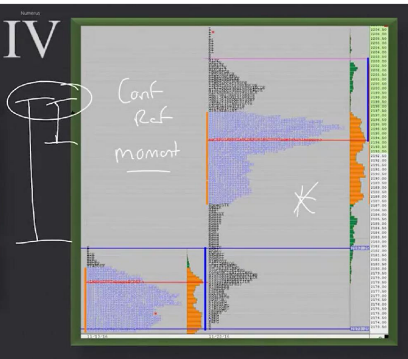
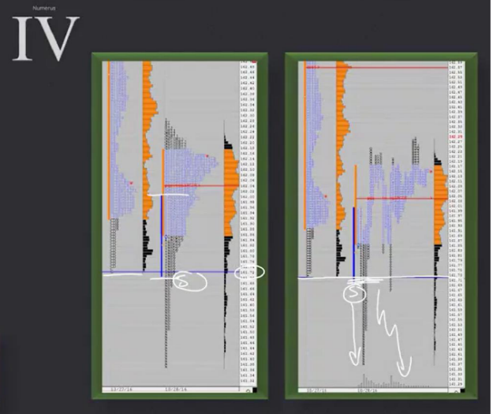
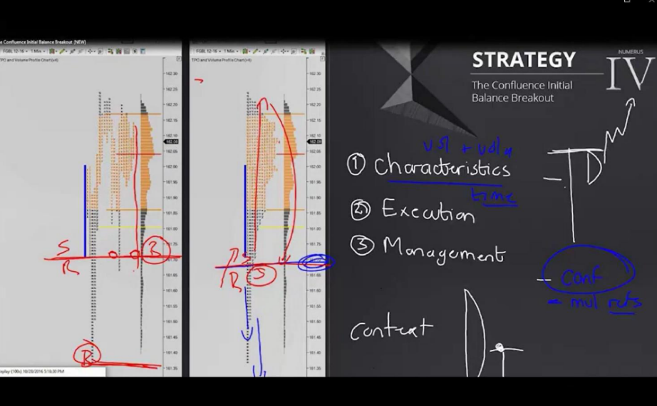

# 📚 CHAPTER 10 — STRATEGY 4

## Strategy 4: The Confluence IB Breakout

---

## 🧩 Overview

This strategy targets Initial Balance breakouts that occur **where multiple important levels meet in the same area (confluence)**. An IB breakout alone is not enough — the combination of **multiple reference points** gives the strategy its power.

```
SINGLE LEVEL (Weak):                 CONFLUENCE (Strong!):

Price ↑                              Price ↑
  |                                     |
  |  ─── IB High                        |  ═══ IB High
  |                                     |  ═══ Previous day High   ← ALL
  |                                     |  ═══ Weekly resistance   ← IN SAME
  |                                     |  ═══ Volume Node         ← AREA!
  |  ─── IB Low                         |
  |                                     |  ─── IB Low
  |                                     |
  └────→                                └────→

→ Only 1 level present                → 4 levels stacked together
→ Breakout might be weak              → Breakout will be VERY STRONG!
```

> **Simple Explanation:** Imagine trying to break down a door. Breaking a door with one lock is easy. Breaking a door with 4 locks is very hard — but once broken, **nothing can stop what's behind it.** Confluence is like this: when multiple levels break, the move is massive.

---

## 🔑 Critical Concepts



### 1. What is Confluence?

Confluence is when **levels from different timeframes or different analysis methods meet at the same price zone.**

| Level Type | Description | Timeframe |
|------------|-------------|-----------|
| **Weekly High/Low** | The highest/lowest point of this week | Weekly |
| **Daily High/Low** | The highest/lowest point of today or yesterday | Daily |
| **Previous Day High/Low**| Extremes of yesterday's trading session | Daily |
| **IB High/Low** | Extremes of the first 1 hour's range | Intraday |
| **Value Area High/Low** | Upper/lower boundary of value area | Daily |
| **Volume Node** | High/low volume nodes | Various |

```
CONFLUENCE EXAMPLE:

Price: 2180
  ═══ Weekly High:      2182  ┐
  ═══ Prev Day High:    2180  ├── CONFLUENCE ZONE (2178-2182)
  ═══ IB High:          2179  │   4 levels in a 4-point range!
  ═══ VA High (prev):   2178  ┘

→ If this zone breaks, a MASSIVE move is expected!
→ If this zone holds, a very strong reversal could happen!
```

> **Trader's Perspective 🎯:** "Find confluence, find the money. A single level just gives you a clue. But if 3-4 levels come to the same place, the market is screaming at you: 'THIS IS IMPORTANT!'"

### 2. Momentum = Volume + Volatility + Initiative

A breakout from a confluence zone is not enough — this breakout must be supported by **momentum**:

```
MOMENTUM FORMULA:

  ┌──────────────────────────────────┐
  │                                  │
  │  MOMENTUM = VOLUME               │
  │            + VOLATILITY          │
  │            + INITIATIVE          │
  │                                  │
  └──────────────────────────────────┘
```

| Component | What Do We Look For? | How Does It Look? |
|-----------|----------------------|-------------------|
| **Volume** | Volume increase at breakout | Volume bars get larger |
| **Volatility**| Price movements expand | Candles/bars get larger |
| **Initiative**| One-way, decisive movement| Price proceeds without pullbacks |

> [!IMPORTANT]
> **All three must be present!** Volume increases but price doesn't move = FAKE. Price moves but no volume = WEAK. All three together = REAL breakout.

### 3. Initial Range — Inside Previous Day's Range

An important prerequisite for this strategy:

> **Today's Initial Range must be INSIDE yesterday's range.**

```
PREVIOUS DAY:            TODAY:
                          
High ──── 2185              IB High ── 2180  ┐
  |                           |               │ IB is INSIDE
  |    Wide range             |               │ previous day!
  |                           |               │
Low ──── 2150              IB Low ─── 2165   ┘

→ IB (2165-2180) is completely inside yesterday's range (2150-2185) ✅
→ This shows the market is "coiled" and ready to break out
```

> **Simple Explanation:** Think of a spring. The more you compress the spring, the harder it pops when you release it. If the market is compressed inside the previous day, it moves strongly when it breaks.

### 4. One Time Framing

When the breakout occurs, the market switches from **two-way trade to one-side (one time framing) trade**.

```
BEFORE BREAKOUT:                   AFTER BREAKOUT:
(2-way trade)                      (One time framing)

     ↗↘                                    ↗
    ↗  ↘                                 ↗
   ↗    ↘                              ↗
  ↗      ↘                           ↗
           ↗                        ↗
          ↘                       ★ BREAKOUT
           ↗                      
                                  → Each TPO is HIGHER (or lower) 
→ Price goes up and down            than the previous one
→ Buyers and sellers are balanced → One side established dominance
```

| Concept | Description |
|---------|-------------|
| **2-way trade** | Both buyers & sellers active, price goes both ways |
| **One time framing**| One side dominates, every period progresses in one direction |
| **Transition moment**| Switches from 2-way to one-side at confluence breakout |

> **Trader's Perspective 🎯:** "When one time framing starts, only trade in ONE direction. Trading against it is suicide. The market is telling you 'this side won'."

---

## 🎯 TRADE ENTRY RULES



### Entry: Aggressive, Market Order

```
UPWARD BREAKOUT — BUY:

Price ↑
  |
  |              ↗↗↗ MOMENTUM! (Volume + Volatility)
  |            ↗
  |          ↗
  |  ═══════★═══════ CONFLUENCE ZONE (broken!)
  |        ↗  ↑
  |       ↗   │ ★ ENTRY: BUY with Market Order
  |      ↗    │
  |     ↗     │
  |   ═══════════ IB Low
  |           │
  |      STOP ↓ (BELOW the breakout level)
  |
  └──────────────────────→ Time
```

### Entry Details

| Feature | Detail |
|---------|--------|
| **Entry type** | **AGGRESSIVE — Market order** |
| **When?** | When confluence zone breaks with momentum |
| **Stop Loss** | **Below** (long) or **above** (short) the breakout level |
| **Exit** | STAY until you see a clear **initiative in opposite direction** |
| **R/R** | **Tight risk, big opportunities** |

> [!TIP]
> **"Tight risk, big opportunities"** is the best part of this strategy. Because your stop is very close to the confluence zone, the risk is small, but since the breakout is strong, the potential profit is huge.

```
R/R CALCULATION EXAMPLE:

Confluence zone:  2180
Stop Loss:        2177  (3 points below)
Risk:             3 points

Potential targets:
  Target 1: 2190  →  R/R = 10:3 = 3.3:1
  Target 2: 2200  →  R/R = 20:3 = 6.7:1
  Target 3: 2220  →  R/R = 40:3 = 13:1  🎯

→ Tight risk + strong breakout = GREAT R/R ratios!
```

### When to Exit?

> **STAY in the trade until you see a clear reverse initiative!**

| Stay in condition ✅ | Exit ❌ |
|----------------------|---------|
| Price progresses in one direction | Aggressive volume came in opposite direction |
| Every TPO makes new high/low | Price starts to consolidate |
| Volume is in breakout direction | Strong candle/bar formed in opposite direction |
| One time framing continues | One time framing is broken |

---

## 🔄 THE REVERSE BREAKOUT SCENARIO



If the market breaks out, then **turns back and breaks in the opposite direction**, the strategy changes:

```
REVERSE BREAKOUT:

Price ↑
  |
  |         ↗ Upward breakout
  |       ↗
  |  ═══★════ CONFLUENCE  (first broke up)
  |       ↘
  |         ↘  ← Turned back!
  |           ↘
  |  ═══════════ ← Dropped BELOW confluence zone
  |             ↘
  |               ↘↘↘  Continues in REVERSE DIRECTION
  |
  └──────────────────────→ Time
```

### What to Do in This Case?

| Step | Action |
|------|--------|
| 1 | Notice the reverse breakout |
| 2 | Close the previous position (stop might already be triggered) |
| 3 | **Use the previous breakout level as Support/Resistance now** |
| 4 | Look for buy/sell opportunities in the reverse direction |

```
EXAMPLE:

1. Price broke up at 2180 → You went LONG
2. Stop: 2177 → triggered, 3 points loss
3. Price turned back and dropped below 2180
4. Now the 2180 level became RESISTANCE
5. When price pullbacks to 2180 → Enter SHORT
6. Use 2180 as resistance, stop is above 2180
```

> [!WARNING]
> **A reverse breakout can be stronger than the original breakout!** Because the stop orders of "trapped" traders fuel the move in the opposite direction. Therefore, see a reverse breakout as an opportunity, don't get mad!

> **Trader's Perspective 🎯:** "A false breakout is part of life. But a smart trader turns a false breakout in their favor. While everyone else gets trapped, you switch to the other side."

---

## 📝 QUICK SUMMARY TABLE

| Topic | Detail |
|------|-------|
| **Strategy Name** | The Confluence IB Breakout |
| **What do we look for?** | IB breakout in a zone where multiple levels meet |
| **Confluence examples** | Weekly H/L + Daily H/L + IB H/L + VA H/L |
| **Prerequisite** | IB must be inside the previous day's range |
| **Breakout condition**| Momentum = Volume + Volatility + Initiative |
| **Entry** | Aggressive, market order |
| **Stop Loss** | Just beyond the breakout level (tight) |
| **Exit** | Stay until seeing clear reverse initiative |
| **R/R** | Tight risk / Big opportunity (3:1 and above possible) |
| **Reverse breakout**| Use previous level as S/R, trade in reverse direction |
| **Transition** | 2-way trade → One time framing |

---

## 💡 FINAL NOTES — THE TRADER'S MINDSET

1. **Make confluence research your morning routine:** Map out where which levels meet every day before the market opens
2. **Advantage of multiple participants:** If weekly, daily, and intraday traders are watching the same levels, the breakout is stronger
3. **Be ready for false breakouts:** Since confluence zones are strong, there can be false breakouts — but since your stop is tight, the loss remains small
4. **Reverse breakout = second chance:** If you missed the first breakout or got stopped, a reverse breakout gives you a new opportunity
5. **Be patient, be selective:** This strategy doesn't happen often. But when it does, it can be one of the **most profitable** trades
