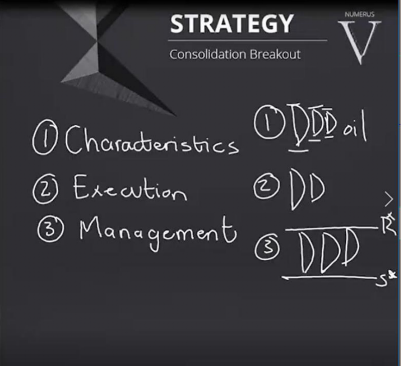
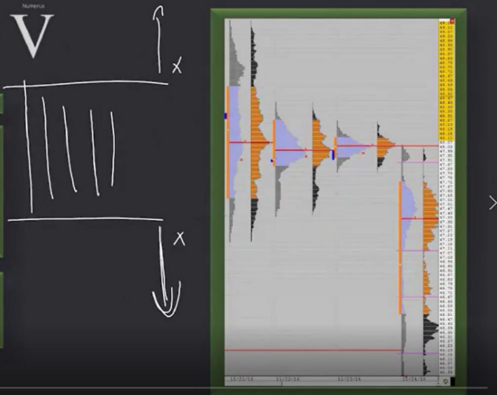
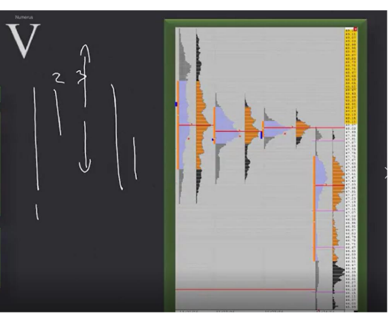
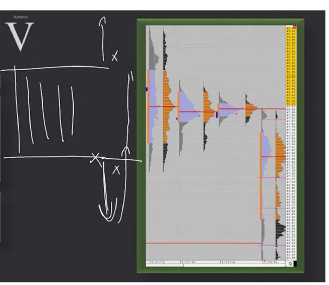

# 📚 CHAPTER 10 — STRATEGY 5

## Strategy 5: The Consolidation Breakout

---

## 🧩 Overview

**Consolidation** is when the market gets **stuck in a specific price range.** Neither buyers nor sellers can establish dominance — it's like a "ceasefire". This squeeze can last **days, weeks, or even months**. But every consolidation eventually **breaks** — and this breakout offers massive opportunities.



```
CONSOLIDATION:

Price ↑
  |
  |  ─────────────────── RESISTANCE (Upper boundary)
  |     ↗↘   ↗↘   ↗↘
  |   ↗    ↘↗   ↘↗   ↘    ← Price is stuck between two boundaries,
  |  ↗                ↘      bouncing back and forth
  |  ─────────────────── SUPPORT (Lower boundary)
  |
  |  |←── Duration: days, weeks, months ──→|
  └──────────────────────────────────────→ Time


BREAKOUT MOMENT:

Price ↑
  |                           ↗↗↗ BREAKOUT!
  |  ─────────────────── ═══★═══
  |     ↗↘   ↗↘   ↗↘     ↗
  |   ↗    ↘↗   ↘↗   ↘↗
  |  ─────────────────── 
  |
  └──────────────────────────────────────→ Time
```

> **Simple Explanation:** Think of a spring. The longer you compress it, the stronger it pops when you let go. Consolidation = the time the spring is compressed. Breakout = the spring popping. **Longer consolidation = Stronger breakout.**

---

## 🔑 Critical Concepts



### 1. What is an Inside Day?

An **Inside Day** is a day where today's price range (high/low) stays **completely inside yesterday's range**.



```
INSIDE DAY:                          NORMAL DAY:

YESTERDAY'S RANGE:                   YESTERDAY'S RANGE:
High ─── 2185                        High ─── 2185
  |                                     |
  |   TODAY'S RANGE:                    |   TODAY'S RANGE:
  |   High ─ 2180  ┐                    |   High ─ 2190  ← Went above yesterday!
  |     |          │ INSIDE!            |     |
  |   Low ── 2160  ┘                    |   Low ── 2170
  |                                     |
Low ──── 2150                        Low ──── 2150

→ Today is INSIDE yesterday ✅        → Today went OUTSIDE yesterday ❌
→ INSIDE DAY                          → NOT an Inside Day
```

> **Trader's Perspective 🎯:** "An Inside Day is the day the market holds its breath. Buyers and sellers are neutralizing each other. But this isn't sustainable — sooner or later, one side will win."

### 2. Relationship Between Consolidation Duration and Breakout Size

> [!IMPORTANT]
> **The longer the consolidation lasts, the bigger the breakout will be!**

```
SHORT CONSOLIDATION:             LONG CONSOLIDATION:
(2-3 days)                       (2-3 weeks)

  ───────                          ──────────────────────────
   ↗↘↗↘                            ↗↘↗↘↗↘↗↘↗↘↗↘↗↘↗↘↗↘
  ───────                          ──────────────────────────
      ↗                                                  ↗↗↗
     ↗  small breakout                                 ↗↗↗
    ↗                                                ↗↗↗
                                                   ↗↗↗  BIG breakout!
                                                 ↗↗↗
```

| Consolidation Duration | Expected Breakout |
|------------------------|-------------------|
| 2-3 days | Small-Medium move |
| 1-2 weeks| Medium-Large move |
| 1 month+ | Large-Massive move|

> **Why?** Orders (both buy and sell) that accumulate during a long consolidation period trigger like an **avalanche** at the moment of breakout. Also, short-term traders' stop orders fuel the breakout direction.

### 3. Breakout Against the Short-Term Trend = Stronger

> [!TIP]
> **If the breakout happens AGAINST the short-term trend, the move will be STRONGER!**

```
SHORT-TERM TREND DOWN:

Price ↑
  |  ↘
  |    ↘  short-term trend
  |      ↘
  |  ──────────── RESISTANCE
  |    ↗↘↗↘       Consolidation
  |  ──────────── SUPPORT
  |         ↗↗↗ UPWARD BREAKOUT! (AGAINST trend)
  |       ↗↗↗
  |     ↗↗↗
  |   ↗↗↗    ← EXTRA STRONG!
  |
  └──────────────→ Time

WHY?
→ Short-term sellers are caught on the "wrong side"
→ Stop orders are triggered (short covering)
→ New buyers also enter
→ Triple fuel: stop triggers + new buying + momentum
```

---

## 📐 TRADE ENTRY RULES



### Entry Point: Breakout Level

```
UPWARD BREAKOUT:

Price ↑
  |
  |              ↗↗↗ INITIATIVE + VOLUME + VOLATILITY
  |            ↗
  |  ════════★════════ RESISTANCE (breakout point)
  |    ↗↘↗↘↗↘  │
  |  ════════════════ SUPPORT
  |              │
  |         ★ ENTRY POINT: At the moment of breakout
  |              │
  |         STOP ↓ (BELOW the breakout level)
  |
  └──────────────────────────→ Time
```

### Entry Checklist

| # | Check | Detail |
|---|-------|--------|
| 1 | ✅ Is there consolidation? | Is price stuck in a specific range? |
| 2 | ✅ Inside Day situation? | 1 vs 2 or more inside days? |
| 3 | ✅ Breakout direction? | Up or down? Against the trend? |
| 4 | ✅ Is there initiative? | Is the breakout one-way, decisive? |
| 5 | ✅ Volume increase? | Is there a noticeable increase in volume bars? |
| 6 | ✅ Volatility increase? | Are price movements expanding? |
| 7 | ✅ Control areas / LVA? | Did an LVA start forming after breakout? |

### Expectations After Breakout

> [!IMPORTANT]
> **We expect to see control areas and an LVA after the breakout!**
> 
> This is confirmation that the breakout is real. If an LVA forms after the breakout, big players are determined to go in that direction.

```
IDEAL POST-BREAKOUT VIEW:

  ════════ old RESISTANCE (broken, now SUPPORT)
       ↗
      ↗
     ↗    ← Single Prints (LVA forming!)
    ↗
   ████████  ← New control area (HVA)
   ████████
   ████████

→ LVA = confirmation of real breakout ✅
→ Control area = new value area forming ✅
→ Connection to STRATEGY 1! (LVA formed → Str.1 rules activate)
```

---

## 📊 RISK MANAGEMENT

### Stop Loss

| Position | Stop Loss |
|----------|-----------|
| **Buy (Upward breakout)** | **BELOW** the breakout level (resistance) |
| **Sell (Downward breakout)**| **ABOVE** the breakout level (support) |

```
EXAMPLE:

Consolidation range: 2150 - 2185
Upward breakout: Moved above 2185

★ Entry:   2186 (at the moment of breakout)
✋ Stop:    2183 (below breakout level)
🎯 Target:  Depends on consolidation duration

Risk: 3 points
If consolidation lasted 5 days → Target: 2185 + 35 = 2220 (estimated)
→ R/R = 35:3 = roughly 12:1 🎯
```

---

## ❌ FAILURE SCENARIO

If the consolidation breakout **fails** (fake breakout), the market turns back and returns into the consolidation area. In this case:

```
FAILED BREAKOUT AND REVERSE OPPORTUNITY:

Price ↑
  |
  |         ↗ Upward breakout (FAILED!)
  |       ↗
  |  ═══★══════ RESISTANCE
  |       ↘
  |         ↘  Turned back
  |    ↗↘↗↘↗↘  Consolidation
  |  ═══════★══ SUPPORT
  |           ↘
  |             ↘↘↘ AGGRESSIVE REVERSE BREAKOUT!
  |
  |  ★ Expectation of RETURN to consolidation area
  |    → Expected to ride TO THE OTHER SIDE
  |
  └──────────────────────────→ Time
```

> [!WARNING]
> **If the consolidation cannot hold (reverse move after failed breakout fails), we look for an aggressive reversal.**
> 
> In this case, we expect price to go **to the other side** of the consolidation area.

| Step | Action |
|------|--------|
| 1 | Upward breakout failed → price turned back |
| 2 | Price couldn't hold the consolidation area → support also broke |
| 3 | **Aggressive sell opportunity!** Expectation of returning to consolidation area |
| 4 | Target: The other side of the consolidation area |

> **Trader's Perspective 🎯:** "A fake breakout provides one of the best trades. While everyone expects an upward breakout, if price turns back, those trapped will panic sell. That panic feeds you."

---

## 📝 QUICK SUMMARY TABLE

| Topic | Detail |
|------|-------|
| **Strategy Name** | Consolidation Breakout |
| **What do we look for?** | A strong breakout of a price stuck in a narrow range |
| **Duration** | Days, weeks, or months |
| **Entry** | At breakout level (support or resistance) |
| **Initiative confirmation**| Volume increase + Volatility increase + One-way move |
| **Stop Loss** | Below/above the breakout level |
| **Rule** | Breakout against the trend is STRONGER |
| **Expectation** | Formation of LVA and control areas |
| **Duration-Power rel.**| Long consolidation = Large breakout |
| **Failure** | Aggressive reversal → expectation of move to the other side |

---

## 💡 FINAL NOTES — THE TRADER'S MINDSET

1. **Patience is your biggest weapon:** You might get bored while consolidation lasts — but the breakout moment makes it worth it. Don't enter early!
2. **Don't enter without initiative:** Don't enter saying "It looks like it will break". SEE IT BREAK, then enter.
3. **Volume and volatility are mandatory:** If price crosses the level but there's no volume = might be a fake breakout
4. **Long consolidation = big opportunity:** You can increase your position size in consolidations that last for weeks (in accordance with risk management, of course)
5. **Fake breakout = reverse opportunity:** If the breakout fails, there's a reverse trade opportunity to the other side
