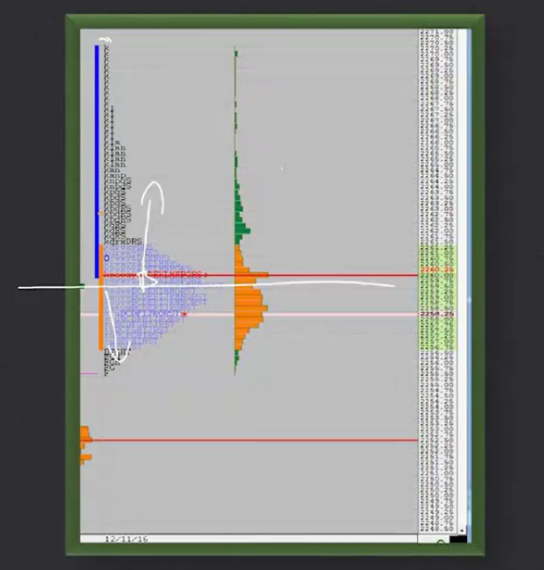
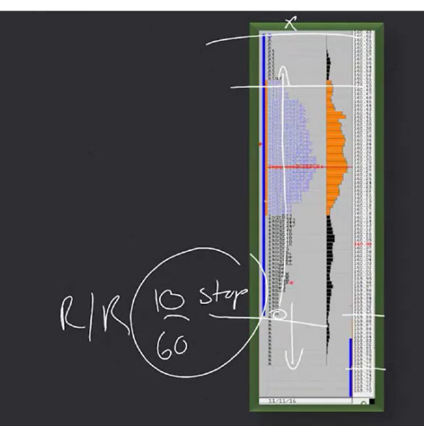

# 📚 CHAPTER 10 — STRATEGY 6

## Strategy 6: Wide Initial Balance Distribution

---

## 🧩 Overview

A **Wide Initial Balance (Wide IB)** is when the market trades in a **much wider range than normal** during its first 1 hour (first 2 TPOs — A and B periods). This indicates that big players made a strong move early on. However, the real trading opportunity emerges based on **how this wide range fills up**.



```
NORMAL IB:                         WIDE IB:

Price ↑                            Price ↑
  |                                  |
  |  ── IB High (2160)               |  ── IB High (2185)    ┐
  |  │  10 points                    |  │                    │
  |  │  (narrow)                     |  │  35 points         │ VERY WIDE!
  |  ── IB Low  (2150)               |  │  (3x normal)       │
  |                                  |  │                    │
  |                                  |  ── IB Low  (2150)    ┘
  |                                  |
  └────→                             └────→

→ Normal day                        → Big players acted early
→ Typical volume                    → Abnormal volume and movement
```

> **Simple Explanation:** In the first 10 minutes of a match, it's normally 0-0 or 1-0. But if the score is 3-0 in the first 10 minutes, that is an "abnormal" situation. That's what a Wide IB is — the market makes a much bigger move in the first hour than it normally should.

---

## 🔑 Reasons for a Wide IB Formation

### 4 Main Reasons

| # | Reason | Description | Example |
|---|--------|-------------|---------|
| 1 | **Fundamental** | New fundamental data overnight affected the market | Central bank decision, employment data, election result |
| 2 | **Technical** | The open occurred beyond an important technical level | Price opened above critical resistance → triggered stops |
| 3 | **Early Initiative**| Long-term participants took aggressive positions early | Institutional investors started buying/selling first thing in the morning |
| 4 | **SMA Confirmation**| Simple Moving Average (SMA) confirms the average range | Average daily range is 15 points, IB alone is 30 points |

### Confirming Wide IB with SMA

```
USING SMA:

Average IB range of the last 20 days (SMA-20):

Day 1:  12 points
Day 2:  15 points
Day 3:  10 points
...
Day 20: 14 points
────────────────
SMA-20: 13 points (average)

TODAY'S IB range: 35 points

35 points >> 13 points (2.7 times the average!)
→ This is DEFINITELY a Wide IB! ✅
```

> [!TIP]
> **Rule of thumb:** If the IB range is **more than 1.5 times** the average IB range of the last 20 days, consider it a Wide IB. If it's more than 2 times, it's a definite Wide IB.

> **Trader's Perspective 🎯:** "Always use SMA to recognize a Wide IB. Don't eyeball it saying 'it looks wide' — confirm it with numbers. A 30-point IB might be wide for one market, but normal for another."

---

## 📐 2 SCENARIOS: What Happens After a Wide IB?

### Scenario 1: P or b Profile Formation

The market goes to one extreme of the Wide IB, **fails**, and turns back to create a P or b profile.

```
SCENARIO 1: P PROFILE (Upward failure)

Price ↑
  |
  |  ── IB High ──────────
  |     ↑ Breakout attempt
  |     ↑ FAILED! ❌
  |     ↓ Turned back
  |  ██████████████  ← Price concentrated at top (P profile)
  |  ████████████
  |  ██████████
  |     │
  |     │  ← Narrow tail (single prints)
  |     │
  |  ── IB Low ───────────
  |
  
  Volume Profile view:
  
  ████████████  ← Wide top (P)
  ████████
  ████
  ██           ← Narrow bottom
  █


SCENARIO 1: b PROFILE (Downward failure)

Price ↑
  |
  |  ── IB High ──────────
  |     │
  |     │  ← Narrow tail
  |     │
  |  ██████████
  |  ████████████
  |  ██████████████  ← Price concentrated at bottom (b profile)
  |     ↓ Breakout attempt
  |     ↓ FAILED! ❌
  |     ↑ Turned back
  |  ── IB Low ───────────
```

| Feature | Detail |
|---------|--------|
| **What happens?** | Price goes to one extreme, fails, distributes back |
| **Profile** | P profile (gathered at top) or b profile (gathered at bottom) |
| **R/R** | **LOWER** — because the move stays limited within the IB |
| **Trade** | Enter in the opposite direction of the failed breakout |

### Scenario 2: Balance Profile Formation

The market opens within the IB and **continues to distribute within the IB range** throughout the day.

```
SCENARIO 2: BALANCE PROFILE

Price ↑
  |
  |  ── IB High ──────────
  |  ████████████████
  |  ██████████████████
  |  ████████████████████  ← Price distributes evenly
  |  ██████████████████       inside wide IB
  |  ████████████████
  |  ── IB Low ───────────
  |
  
  Volume Profile view:
  
  ████████████
  ██████████████
  ████████████████  ← Dense in middle (balance)
  ██████████████
  ████████████
```

| Feature | Detail |
|---------|--------|
| **What happens?** | Price distributes evenly within the Wide IB |
| **Profile** | Normal/Balance profile |
| **R/R** | **HIGHER** — because the extension within a wide IB can be large |
| **Trade** | Reversal opportunities at the IB extremes |

> **Trader's Perspective 🎯:** "If a P/b profile forms, R/R is low but the hit rate is high. If a balance profile forms, R/R is higher because you expect a move from one end of the wide IB to the other. Both are profitable — just adjust your expectations."

---

## 🎯 TRADE ENTRY RULES



### Core Logic: Breakout + Failure = Reverse Entry

```
UPWARD BREAKOUT + FAILURE → SELL:

Price ↑
  |
  |        ↗ Breakout (Above IB High)
  |      ↗
  |  ══★══════ IB High
  |      ↘ FAILED! Turned back
  |        ↘
  |          ★ ENTRY: SHORT (sell)
  |            ↘
  |              ↘↘ Target: Bottom of IB
  |
  |  ══════════ IB Low ← potential target
  |
  |  STOP ↑ (ABOVE the breakout extension)
  |
  └──────────────────────────→ Time


DOWNWARD BREAKOUT + FAILURE → BUY:

Price ↑
  |
  |  ══════════ IB High ← potential target
  |
  |          ★ ENTRY: LONG (buy)
  |        ↗
  |      ↗ FAILED! Turned back
  |  ══★══════ IB Low
  |      ↘
  |        ↘ Breakout (Below IB Low)
  |
  |  STOP ↓ (BELOW the breakout extension)
  |
  └──────────────────────────→ Time
```

### Entry Details

| Feature | Detail |
|---------|--------|
| **What do we look for?** | Market breaking one end of Wide IB and **failing** |
| **Entry** | In **opposite direction** after failed breakout |
| **Extension** | Targets a **significant portion** of the Wide IB |
| **Stop Loss** | **Below/above** the breakout extension |

---

## 🔗 COMBINING WITH PRICE ACTION

### Why Do We Use Price Action?

> [!IMPORTANT]
> **Profile analysis generates the IDEA, Price Action EXECUTES THE IDEA.**
> 
> The two complement each other — one is incomplete without the other.

```
PROFILE ANALYSIS          +          PRICE ACTION
─────────────────                    ─────────────────
                                   
"WHAT should I do?"                  "WHEN and HOW should I do it?"
                                   
• Find value area                    • Determine entry timing
• Identify imbalance                 • Determine exit timing
• Predict direction                  • See price confirmation
• Select strategy                    • Execute strategy
                                   
IDEA GENERATION                      IDEA EXECUTION
(Principle)                          (Action)
```

### Price Action Confirmations at Breakout

```
PRICE ACTION CONFIRMATIONS AT BREAKOUT MOMENT:

1. VOLUME CHANGE
   ────────────────
   Before breakout: ░░░░ (low volume)
   Breakout moment: ████████████ (high volume!)
   
2. PRICE AUCTION PROCESS
   ──────────────────────────
   Before breakout: Price goes back and forth (two-way auction)
   Breakout moment: Price proceeds in one direction (one-way advertisement)
   
3. PRICE SPEED
   ──────────
   Before breakout: Slow, hesitant movements
   Breakout moment: Fast, decisive movements
```

---

## 📝 QUICK SUMMARY TABLE

| Topic | Detail |
|------|-------|
| **Strategy Name** | Wide Initial Balance Distribution |
| **What do we look for?** | Much wider than normal IB and subsequent distribution |
| **Wide IB reasons** | Fundamental, technical, early initiative, SMA confirmation |
| **Scenario 1** | P/b profile → failed breakout → reverse entry (low R/R) |
| **Scenario 2** | Balance profile → distribution inside IB (high R/R) |
| **Entry** | In reverse direction after breakout + failure |
| **Stop Loss** | Below/above breakout extension |
| **SMA usage** | Calculate average IB range, compare |
| **Price action** | Profile = idea generation, Price Action = idea execution |

---

## 💡 FINAL NOTES — THE TRADER'S MINDSET

1. **Check SMA every morning:** Know the average IB range. If today's IB is wider than normal, let the alarm ring immediately
2. **Wide IB = big players spoke:** Understand why they spoke (fundamental or technical?)
3. **Failed breakout = best trade:** If the market breaks the extreme of a Wide IB and returns, those trapped become your fuel
4. **Profile + Price Action = Complete package:** Knowing one is not enough, learn both and use them together
5. **Be patient on Wide IB days:** If the first hour already made a massive move, don't rush — wait for distribution, see the pattern, then enter
