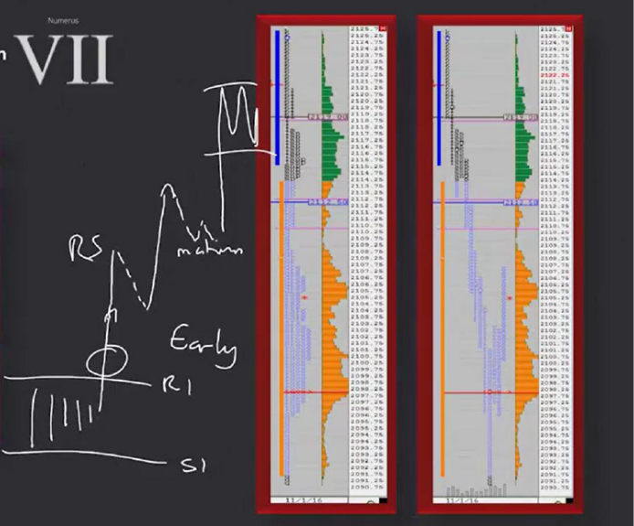
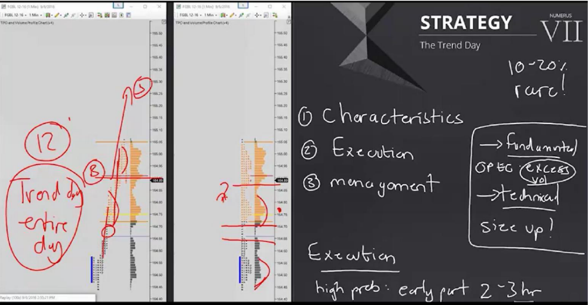
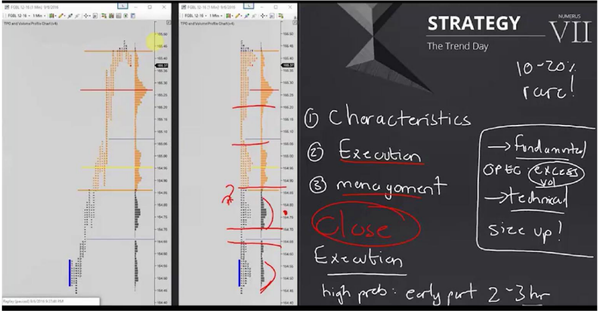

# 📚 MOMENTUM DEFINITION AND STRATEGY 7

## What is Momentum?

---

## 🔑 Momentum Definition

**Momentum** refers to a situation where the market moves in a **strong, one-way, and fast** manner. All timeframes take initiative in the same direction.

### 6 Characteristics of Momentum

| # | Feature | Description |
|---|---------|-------------|
| 1 | **Price discovery mode** | Market is exploring new price levels, stepping out of known areas |
| 2 | **Very little price overlap** | Overlap between TPOs is minimal — every period is new territory |
| 3 | **Reference points are ignored**| Technical support/resistance levels are easily crushed |
| 4 | **One time framing** | Every TPO is higher (or lower) than the previous one |
| 5 | **All timeframes in same direction**| Short, medium, and long-term players are on the same side |
| 6 | **Volume and volatility increase**| Both rise together |

```
MOMENTUM VIEW (Upward):

TPO A:  ██
TPO B:    ███
TPO C:      ████
TPO D:        █████
TPO E:          ██████

→ Every period is ABOVE the previous one
→ Overlap is minimal or non-existent
→ This is ONE TIME FRAMING
```

> [!CAUTION]
> **Bias Trap:** Momentum gives you the feeling that "this will last forever". CAUTION! Every momentum ends one day. Trade according to your rules, not your emotions.

---

## 📚 STRATEGY 7: THE TREND DAY

---

## 🧩 Overview

A **Trend Day** is a rare but very powerful day where all participants trade **in the same direction**. It occurs only **5-25%** of the time.



```
NORMAL DAY:                        TREND DAY:

Price ↑                            Price ↑
  |    ↗↘↗↘                          |                    ↗
  |   ↗    ↘                          |                 ↗
  |  ↗      ↗↘                        |              ↗
  |           ↘↗                       |           ↗
  |                                    |        ↗
  └──────────→                         |     ↗
                                       |  ↗
→ Two-way, indecisive                 └──────────→
                                     → ONE WAY, non-stop!
```

---

## 📐 CHARACTERISTICS OF A TREND DAY



| Feature | Detail |
|---------|--------|
| **Frequency** | 5-25% (rare!) |
| **Duration** | Lasts ALL DAY |
| **Start** | First 2-3 hours of the session (early stage) |
| **Continuation** | Can last multiple sessions |
| **Price overlap** | None or very little |
| **Respect for levels**| NONE — crushes support/resistance |
| **Volume** | Increasing, expanding |
| **Reason** | Fundamental or technical |

### 3 Phases: Early → Mature → Late

```
TREND DAY PHASES:

Price ↑
  |                                         ████ LATE
  |                                      ████    (slowing down)
  |                                   ████
  |                              █████
  |                          █████
  |                     █████          MATURE
  |                █████               (strongest, fastest)
  |           █████
  |      █████
  |   ████
  | ████  EARLY (recognition phase)
  └─────────────────────────────────→ Time
     ◄─ 2-3 hours ─►◄── Mid-day ──►◄─ End ─►
```



| Phase | Duration | Feature | Strategy |
|-------|----------|---------|----------|
| **Early** | First 2-3 hours | Trend starting, opportunity to recognize | First entry opportunities |
| **Mature**| Mid-day | Fastest move, peak momentum | Hold current position |
| **Late** | Final hours | Slowing down, profit taking starts | Consider taking profit |

---

## 🔍 EARLY RECOGNITION CLUES

**Recognizing a trend day early** is the most critical skill. Here are the clues:

### 1. Potential Engulfing Pressures
```
Yesterday's range:   ████████████
Today's open:               ↗↗↗↗↗↗↗ → Engulfed yesterday's HIGH!
```
Today's price "engulfs" the previous day's range.

### 2. IB High/Low Taken and Cannot Return
```
IB High broken → price DID NOT RETURN → one-way continues
```

### 3. LVA and Single Print Formation
```
████ ← HVA
 |   ← Single Print (LVA)
 |   ← Single Print
████ ← New HVA (lower/higher)
```

### 4. Double Distribution Profile Appearance
A trend day looks like a "double distribution" in its early stages, **the difference is timing:** the move happens in the early stage.

### 5. VPOC Moves in the Direction of the Trend
```
10:00 VPOC: 2155
11:00 VPOC: 2162  ↑ shifting up
12:00 VPOC: 2170  ↑ shifting up

→ If VPOC is moving in trend direction = TREND DAY confirmation!
```

> **Trader's Perspective 🎯:** "Moving VPOC is the strongest confirmation. On normal days, VPOC stays in place. On a trend day, VPOC moves along with the price."

---

## 🎯 TRADE ENTRY RULES

### Entry: Small Distribution/Accumulation Areas

```
TREND DAY ENTRY:

Price ↑
  |
  |                    ↗↗↗ continues
  |               ████★    ← 3rd Mini distribution → ENTRY 3
  |            ↗↗↗
  |       ████★            ← 2nd Mini distribution → ENTRY 2
  |    ↗↗↗
  | ████★                  ← 1st Mini distribution → ENTRY 1
  | ↗↗↗ trend starts
  └──────────────────────→ Time

████ = Small consolidation/distribution area (pause)
  ★ = ENTRY POINT
```

The market doesn't go straight up/down on a trend day — it takes **small pauses**. These pauses (mini distribution/accumulation areas) are your entry points.

### Entry Details

| Feature | Detail |
|---------|--------|
| **Where?** | At small distribution/accumulation areas (mini consolidations) |
| **Stop Loss** | **Below** (long) or **above** (short) the consolidation area |
| **R/R** | **UNLIMITED** — depends on fundamental/structural initiative |
| **Exit** | STAY until you see a clear reversal signal |

### Fundamental vs Technical Trend Difference

| Type | Advantage | Disadvantage |
|------|-----------|--------------|
| **Fundamental**| Very strong, can last long | Extreme volatility → uncomfortable trade |
| **Technical** | More orderly movement | Might be shorter-lived |

> [!WARNING]
> **Fundamental trend days can be very volatile!** In trends driven by major news, even if the price direction is right, sudden sharp pullbacks can stop you out. Reduce your position size, keep a slightly wider stop.

---

## 📝 QUICK SUMMARY

| Topic | Detail |
|------|-------|
| **Strategy Name** | The Trend Day |
| **Frequency** | 5-25% (rare!) |
| **Direction** | All participants in the same direction |
| **Duration** | All day + potential multiple sessions |
| **Early recognition**| Engulfing, IB break, LVA/SP, VPOC shift |
| **Entry** | In mini distribution/accumulation areas |
| **Stop** | Below/above consolidation area |
| **R/R** | Unlimited |
| **Phases** | Early (2-3 hrs) → Mature → Late |
| **Trap** | Bias trap — don't assume it will last forever |

---

## 💡 FINAL NOTES

1. **Trend days are rare — but they make your year:** A huge portion of your yearly profit comes from a few trend days
2. **Early recognition is everything:** If you can't recognize it in the first 2-3 hours, you miss the train
3. **Watch VPOC:** If it moves, it's a trend day; if it stands still, normal day
4. **Enter on mini consolidations:** Don't think "it's too late now" in the middle of a trend — every pause is a new opportunity
5. **Let unlimited R/R truly be unlimited:** Taking profit early is the biggest mistake on a trend day

> [!TIP]
> **A trend day is an "add-on" day.** Add a new position at every mini consolidation (pyramiding). Don't forget risk management but be aggressive — this is your day.
