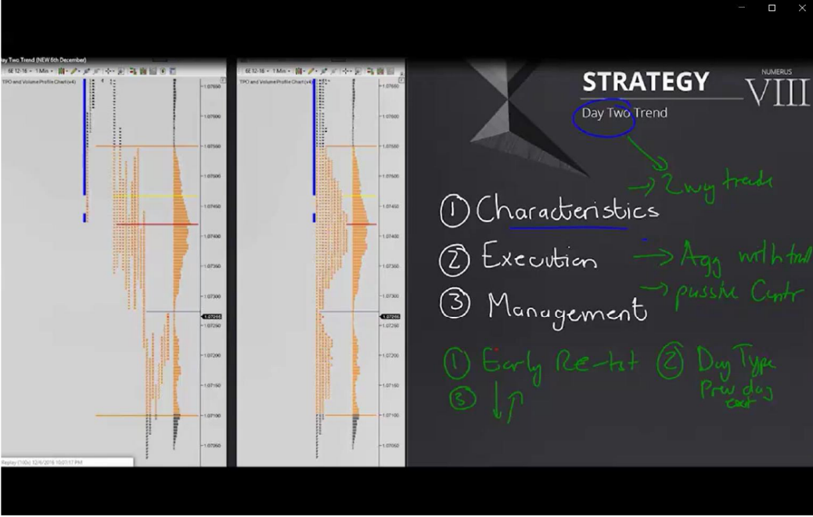
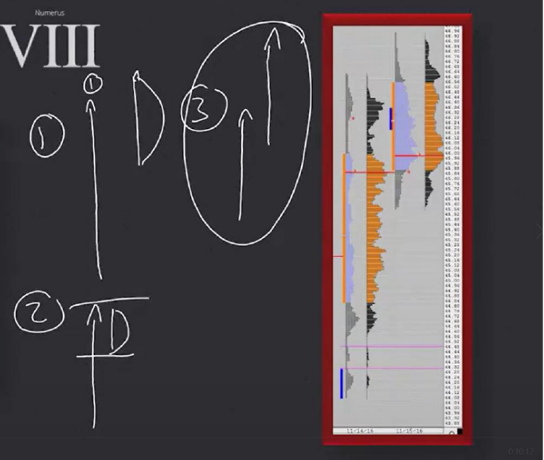
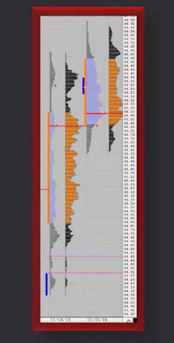
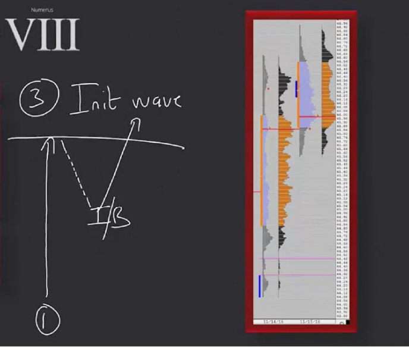

# 📚 CHAPTER 11 — STRATEGY 8

## Strategy 8: Day Two Trend

---

## 🧩 Overview

After a Trend Day (Strategy 7) happens, **what happens the next day?** The answer to this question is Strategy 8. On the second day, different scenarios emerge depending on **why** the trend occurred.



### Golden Rule: Fundamental vs Technical

| Reason for Initial Trend Day | Expectation for Second Day |
|------------------------------|----------------------------|
| **Fundamental** (news, data) | 🟢 **Second trend day HIGH probability** |
| **Technical** (level broken) | 🟡 **Distribution day HIGH probability** |

```
FUNDAMENTAL TREND:                   TECHNICAL TREND:

DAY 1:  ↗↗↗↗↗ (trend)              DAY 1:  ↗↗↗↗↗ (trend)
DAY 2:  ↗↗↗↗↗ (trend continues!)   DAY 2:  ↗↘↗↘↗↘ (distribution)

→ Fundamental power continues       → Technical move exhausted
→ New buyers are still entering     → Profit taking + distribution begins
```

> **Trader's Perspective 🎯:** "Understanding why it trended determines what you do the next day. If the central bank cut rates, the effect doesn't end in 1 day — a trend is expected on day 2. But if only a technical resistance was broken, distribution is more likely on day 2."

---

## 📊 3 DIFFERENT SECOND DAY SCENARIOS



### Scenario 1: Extension Attempt + Failure + Distribution

```
DAY 1 (Upward Trend):         DAY 2 (Scenario 1):

  |          ↗ PEAK              |    ↗ Extension attempt
  |        ↗                     |  ↗   FAILED! ❌
  |      ↗                      |    ↘
  |    ↗                         |  ↗↘↗↘  Distribution area formed
  |  ↗                           |  ↗↘↗↘
  └──────→                       └──────→
```

- Market **tries** to extend the previous day's trend but **fails**
- Then forms a **distribution area**
- 2-way trade begins

### Scenario 2: Extension Failure + Inside Day

```
DAY 1 (Upward Trend):         DAY 2 (Scenario 2):

  |          ↗ PEAK              | ─── Yesterday's High ───
  |        ↗                     |   ↗↘↗↘  Inside day!
  |      ↗                      |   ↗↘↗↘  (INSIDE yesterday)
  |    ↗                         | ─── Yesterday's Low ────
  |  ↗                           |
  └──────→                       └──────→
```

- Market cannot make an extension and stays **inside** yesterday's range
- An **Inside day** forms
- Distributes, potential Strategy 5 (consolidation) setup



### Scenario 3: Strong Extension + Second Trend Day 🔥

```
DAY 1 (Upward Trend):         DAY 2 (Scenario 3):

  |          ↗ PEAK              |                    ↗↗ NEW PEAK!
  |        ↗                     |                 ↗↗
  |      ↗                      |              ↗↗
  |    ↗                         |  ── Yest. High broken!
  |  ↗                           |           ↗↗
  └──────→                       └──────→
```

- Market **breaks** yesterday's range and shows strong initiative
- A **second trend day** forms
- Strongest scenario — usually **fundamental** driven

> [!IMPORTANT]
> **Distinguishing the 3 scenarios EARLY is critical.** You must understand which scenario you are in within the first 1-2 hours. If you trade based on the wrong scenario, you will lose money.

---

## 🎯 3 TRADE ENTRY METHODS

### Entry 1: Retest of Previous Day's High/Low (HIGHEST PROBABILITY)

```
Price ↑
  |
  |  ─── Yesterday's High ──────────
  |         ↗                    
  |       ↗  ← Retest (touches)
  |         ↘                    
  |           ↘ ★ ENTRY: SHORT
  |             ↘↘↘ downward rotation
  |
  └──────────────────────→ Time

→ Highest probability entry
→ Price tests yesterday's peak and TURNS BACK
→ Enter in reverse direction expecting distribution
```

| Feature | Detail |
|---------|--------|
| **What happens?** | Price reaches yesterday's high/low and is rejected |
| **Entry** | In reverse direction after retest |
| **Probability** | ⭐⭐⭐⭐⭐ Highest |
| **Expectation** | Distribution area formation |

### Entry 2: Breakout + Failure → Reverse Entry

```
Price ↑
  |
  |     ↗ BROKE Yesterday's High
  |   ↗
  |  ─── Yesterday's High ──────
  |   ↘ But COULDN'T HOLD! ❌
  |     ↘ Fell back
  |       ★ ENTRY: SHORT (reverse direction)
  |         ↘↘↘ Expect strong rotation
  |
  └──────────────────────→ Time
```

| Feature | Detail |
|---------|--------|
| **What happens?** | Price breaks yesterday's high/low but can't hold |
| **Entry** | In reverse direction after failed breakout |
| **Probability** | ⭐⭐⭐⭐ High |
| **Expectation** | Strong reverse rotation (trapped traders become fuel) |

### Entry 3: Pullback + New Initiative Wave (Second Trend Day)



```
Price ↑
  |
  |                    ↗↗↗ NEW INITIATIVE WAVE!
  |               ★ ENTRY (after pullback)
  |              ↗
  |         ↗↘↗   ← Pullback
  |       ↗
  |  ─── Yest. High ── (broke and held!)
  |     ↗
  |   ↗
  └──────────────────────→ Time
```

| Feature | Detail |
|---------|--------|
| **What happens?** | Price breaks yesterday's range, pulls back, continues |
| **Entry** | After pullback, on new initiative wave |
| **Probability** | ⭐⭐⭐ (but ⭐⭐⭐⭐⭐ with fundamental backing) |
| **Expectation** | Second trend day starts |

> **Trader's Perspective 🎯:** "The new initiative wave in Entry 3 is the move created by those who **missed** the train on the first day. Big players who thought 'it was too expensive/cheap yesterday, I didn't enter. But I'm entering on the pullback!' create this wave."

---

## 📐 TRADE FRAMEWORK NOTES (From Slides)

### Execution Types Comparison

| Situation | Entry Type | Direction |
|-----------|------------|-----------|
| Retest successful (price turned) | **Passive contrarian** (limit order) | Against trend |
| Breakout + failure | **Aggressive contrarian** (market order) | Against trend |
| Pullback + new wave| **Aggressive with trend** (market order)| Trend continues |

---

## 📝 QUICK SUMMARY

| Topic | Detail |
|------|-------|
| **Strategy Name** | Day Two Trend |
| **Prerequisite** | Previous day must be a TREND DAY |
| **After fundamental trend**| Second trend day high probability |
| **After technical trend** | Distribution day high probability |
| **Scenario 1** | Extension + failure + distribution |
| **Scenario 2** | Inside day (inside yesterday) |
| **Scenario 3** | Strong extension + second trend day |
| **Entry 1** | Retest (highest probability) |
| **Entry 2** | Breakout + failure → reverse entry |
| **Entry 3** | Pullback + new initiative wave |

---

## 💡 FINAL NOTES

1. **Understand the "why" of the previous day:** Fundamental or technical? This determines your Day 2 strategy
2. **First 1-2 hours are critical:** Notice which scenario it is early on
3. **Retest is the safest entry:** Retesting yesterday's high/low is the highest probability trade
4. **Trapped traders are your fuel:** Breakout + failure = stop triggers = movement in your favor
5. **New wave = opportunity for the latecomers:** A second chance for those who missed the first day
