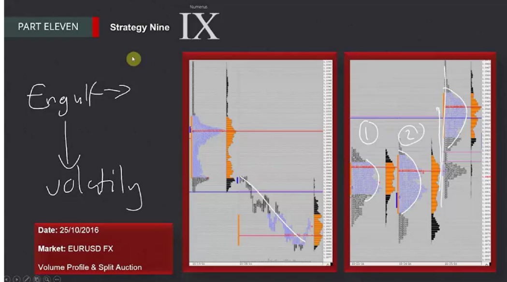
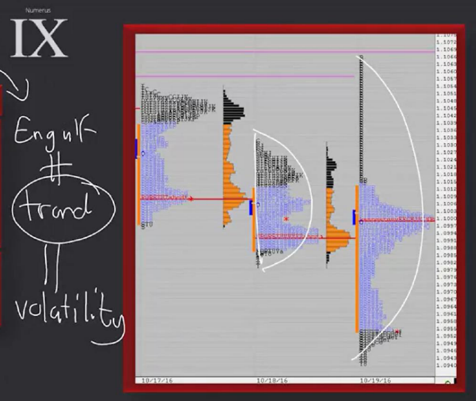
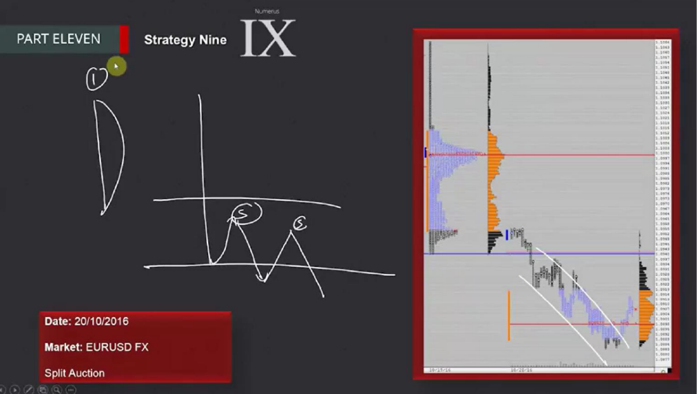

# 📚 CHAPTER 11 — STRATEGY 9

## Strategy 9: Engulfing Profiles & Value Areas

---

## 🧩 Overview

**Engulfing** is when the second day's price range **completely covers/engulfs the previous day's value area.** This indicates a massive burst of **volatility** in the market and a shift in the balance of power.



```
PREVIOUS DAY:                  ENGULFING DAY:

Price ↑                         Price ↑
  |                                |  ── Engulfing High ──── 
  |   ── VA High ──               |  │                     
  |   █████████                    |  │  Completely ENGULFED
  |   █████████  Value Area        |  │  previous VA!
  |   █████████                    |  │                     
  |   ── VA Low ───               |  │  ██████████████████  
  |                                |  │  ██████████████████  
  |                                |  │  ██████████████████  
  |                                |  ── Engulfing Low ─────
  |                                |
  └────→                           └────→

→ Normal value area               → Previous value area is entirely
                                     swallowed by the new day!
```

> **Simple Explanation:** Think of a big fish swallowing a small fish. The previous day's value area is the "small fish", the engulfing day is the "big fish". The big fish completely covered the small one — this means a shift in power.

### Engulfing = Volatility

> [!IMPORTANT]
> **Engulfing = Volatility explosion.** This is different from a trend day (Strategy 7)! A trend day is a ONE-WAY strong move. Engulfing is a wide move in BOTH DIRECTIONS with high volatility — but eventually one side wins.



```
TREND DAY (Str.7):               ENGULFING (Str.9):

  ↗                                ↗↘
  ↗                               ↗  ↘
  ↗                              ↗    ↘
  ↗                                    ↘
  ↗  ONE WAY                     ↗  ↘ ↗
                                    ↘   TWO WAY + HIGH VOLATILITY
→ Orderly, one-way               → Chaotic, wide, volatile
→ Every TPO progresses           → Big swings
```

---

## 🔑 Reasons for Engulfing Formation

### 2 Main Reasons

| # | Reason | Description | Example |
|---|--------|-------------|---------|
| 1 | **Position shift** | Control shifts from buyers to sellers (or vice versa) | Big funds closed positions, opened in new direction |
| 2 | **Fundamental shift**| A fundamental change alters the trend direction | Central bank expectation changed, data surprise |

```
POSITION SHIFT:

PREVIOUS DAY:                  ENGULFING DAY:
Buyers are in control           Sellers took control

  ████ ↑ Upward trend              ↗ one last rise
                                     ↘↘↘ SELL-OFF WAVE
                                       ↘↘↘
                                         ↘↘↘ New direction: DOWN
```

> **Trader's Perspective 🎯:** "Engulfing is the day the market 'changes its mind'. Yesterday buyers were in control, today sellers came in and erased all of yesterday. This is a huge message — listen to it!"

---

## 📊 IMPORTANCE OF CLOSING PRICE

> [!IMPORTANT]
> **On an Engulfing day, the closing price is VERY IMPORTANT!**

The closing price shows two things:

### 1. Early Market Sentiment

```
Engulfing day closed HIGH:          Engulfing day closed LOW:

  ── High ──                          ── High ──
  │                                   │
  │          ★ CLOSE (at top)         │
  │                                   │
  │                                   │
  │                                   │          ★ CLOSE (at bottom)
  ── Low ──                           ── Low ──

→ Sentiment: Buyers won               → Sentiment: Sellers won
→ Next session: upward bias           → Next session: downward bias
```

> **CAUTION:** The close shows **sentiment**, not **direction**! Meaning "it will likely go this way" — not a guarantee.

### 2. Next Session Retest Expectation

```
Close is near HIGH:                  Next session expectation:
                                     
  ★ close                             → Price will RE-TEST that
  ── High ──                            HIGH level
                                        (high probability)

Close is near LOW:                   Next session expectation:

  ── Low ──                           → Price will RE-TEST that
  ★ close                               LOW level
```

> **Trader's Perspective 🎯:** "Look at the close of the engulfing day. Where did it close? At the top or bottom? This draws a map for you for the next day. The level near the close will likely be tested — look for trading opportunities there."

---

## 🎯 TRADE ENTRY RULES



### Entry Logic: Extreme Breakout

```
Price ↑
  |
  |  ── Engulfing High ─────────
  |  │                          
  |  │  Engulfing day range     
  |  │                          
  |  │  ██████████████████      
  |  │  ██████████████████      
  |  │                          
  |  ── Engulfing Low ──────────
  |       ↘ BREAKOUT! (Low broke)
  |         ★ ENTRY: SHORT
  |           ↘ Rally → Pullback → Small extension
  |
  |  STOP ↑ (ABOVE the breakout level)
  └──────────────────────────→ Time
```

### Entry Details

| Feature | Detail |
|---------|--------|
| **Entry type** | **Relatively PASSIVE** (heavy on limit orders) |
| **When?** | When the extreme (high or low) of the engulfing day is broken |
| **Stop Loss** | **Above/below** the breakout level |
| **Expected move**| Rally → Pullback → Small extension |
| **Aggressiveness**| LOW — moves are NOT as aggressive as a trend day |

> [!WARNING]
> **Moves on engulfing days are not as aggressive as on trend days!** We expect rallies, pullbacks, and small extensions — not massive one-way runs. Adjust your expectations accordingly.

### Move Pattern

```
TYPICAL MOVE POST-ENGULFING:

Price
  |
  |   ↗ Rally (small rise)
  |  ↗
  | ★ Entry
  |  ↘ Pullback
  |    ↘
  |      ↗ Small extension
  |    ↗
  |      ↘ Pullback
  |        ↗ Small extension
  |
  └────────────────→ Time

→ We DO NOT expect a huge move all at once
→ Step by step: rally + pullback + extension
→ Be patient, take a little profit at each step
```

> **Trader's Perspective 🎯:** "Engulfing trades are not 'get rich quick' trades. They are more like 'be patient and disciplined' trades. Small rallies and pullbacks — take a bit of profit from each. Don't expect huge moves."

---

## 🔄 COMPARING STRATEGIES 7, 8, 9 (Momentum Group)

| Feature | Str.7 Trend Day | Str.8 Day Two | Str.9 Engulfing |
|---------|-----------------|---------------|-----------------|
| **Character**| One-way, strong | Reaction to prev. trend | Volatility explosion |
| **Volatility**| High (one-way) | Medium | VERY high (two-way) |
| **Direction**| Single | Depends on scenario | Two-way → then one side |
| **Aggression**| Very aggressive | Medium | Passive |
| **R/R** | Unlimited | Depends on scenario | Medium (small extensions) |
| **Duration**| All day | Second day | Days post-engulfing |
| **Entry** | Mini consolidations| Retest/breakout/wave | Extreme breakout |

---

## 📝 QUICK SUMMARY

| Topic | Detail |
|------|-------|
| **Strategy Name** | Engulfing Profiles & Value Areas |
| **What happens?** | Day 2 completely engulfs Day 1's value area |
| **Engulfing = ?** | VOLATILITY (not trend!) |
| **Reason** | Position shift or fundamental shift |
| **Close** | Sentiment indicator + retest clue for next session |
| **Entry type** | Passive (limit order) |
| **Entry point** | When engulfing day's extreme is broken |
| **Stop** | Beyond breakout level |
| **Move pattern** | Rally → Pullback → Small extension (step by step) |
| **Aggressiveness**| Low — movements are not aggressive |

---

## 💡 FINAL NOTES

1. **Engulfing ≠ Trend:** The biggest mistake is trading an engulfing day like a trend day. Moves are more chaotic and less orderly
2. **Look at the close:** The engulfing day's close gives you the compass for the next day
3. **Be passive:** This strategy requires patience. Work with limit orders, don't chase with market orders
4. **Target small extensions:** Don't expect big moves — rallies + pullbacks + small steps
5. **Notice position shifts early:** If buyers were in control yesterday but sellers are coming in today, that's a huge message
